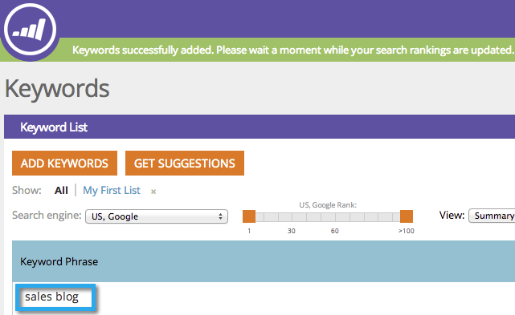

# SEO - Ottieni parole chiave suggerite {#seo-get-suggested-keywords}

Marketo SEO può suggerire quali parole chiave dovresti tenere traccia. Possiamo fornire suggerimenti basati su una parola chiave o sull’URL di un sito. Dai una mossa!

## Ottieni suggerimenti per parole chiave utilizzando una parola chiave {#get-keyword-suggestions-using-a-keyword}

1. Vai alla sezione **Parole chiave** .

   

1. Fare clic su **Ottieni suggerimenti**.

   

1. Immetti una **Parola chiave**. Fare clic su **Suggerisci parole chiave**.

   

   >[!TIP]
   >
   >Sapevi di poter [aggiungere la parola chiave a un elenco nuovo o esistente](/help/marketo/product-docs/additional-apps/seo/understanding-seo/seo-managing-lists.md) proprio qui?

1. Seleziona le parole chiave suggerite. Fai clic su **Aggiungi selezionati**.

   

   Fantastico! La parola chiave è stata aggiunta.

   

   Sì! Ora che sai come ottenere suggerimenti per parole chiave basati su una parola chiave, prova a ricevere suggerimenti basati su un URL.

## Ottieni suggerimenti parole chiave da un URL {#get-keyword-suggestions-from-a-url}

1. Vai alla sezione **Parole chiave** .

   

1. Fare clic su **Ottieni suggerimenti**.

   

1. Imposta **Suggerisci per** su **URL**.

   

1. Inserisci un **URL** e fai clic su **Suggerisci parole chiave**.

   

   >[!TIP]
   >
   >Sapevi di poter [aggiungere la parola chiave a un elenco nuovo o esistente](/help/marketo/product-docs/additional-apps/seo/understanding-seo/seo-managing-lists.md) proprio qui?

1. Seleziona le parole chiave suggerite. Fai clic su **Aggiungi selezionati**.

   

1. Fantastico! La parola chiave è stata aggiunta.

   

   Ok, stai rockin questa cosa. Continuate!

   >[!MORELIKETHIS]
   >
   >* [Parole chiave (visualizzazione di riepilogo)](/help/marketo/product-docs/additional-apps/seo/keywords/seo-understanding-keywords.md)
   >* [Aggiungi/rimuovi parole chiave da un elenco](/help/marketo/product-docs/additional-apps/seo/keywords/seo-add-remove-keywords-from-a-list.md)

