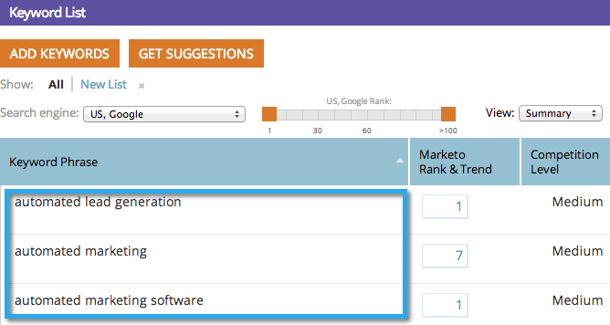

# SEO - Importazione di parole chiave con un file CSV {#seo-importing-keywords-with-a-csv}

1. Potete [aggiungere manualmente le parole chiave](seo-add-keywords.md), [ottenere i suggerimenti per le parole chiave](seo-get-suggested-keywords.md) e persino importare le parole chiave da un file CSV. Di seguito viene illustrato come effettuare l’importazione.
1. Andate alla sezione **Parole chiave**.

   

1. Fare clic su **Importa**.

   

1. Scegliete un file Excel da importare.

   

1. Fare clic su **Scegli file**.

   

   >[!NOTE]
   >
   >I limiti di importazione variano a seconda dell’iscrizione. Per ulteriori informazioni, contattate il rappresentante commerciale.

1. Fare clic su **IMPORT**.

   

   Le nuove parole chiave dovrebbero essere visualizzate in ordine alfabetico nell&#39;elenco delle parole chiave.

   

   Potrebbero essere necessari alcuni minuti per caricare tutti i dati associati a ciascuna parola chiave. Meditate sul significato della vita.

   >[!NOTE]
   >
   >**Articoli correlati**
   >
   >    
   >    
   >    * [Informazioni sulle parole chiave (visualizzazione di riepilogo)](seo-understanding-keywords.md)
   >    * [Aggiunta/rimozione di parole chiave da un elenco](seo-add-remove-keywords-from-a-list.md)

