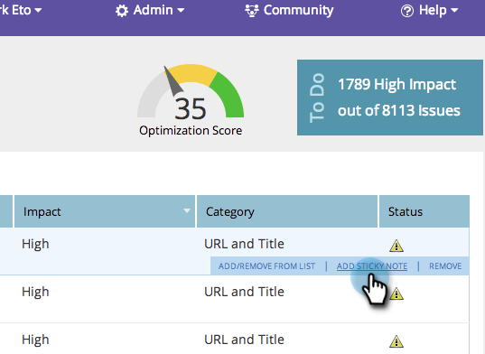

# SEO - Aggiungere note ai problemi di pagina {#seo-add-notes-to-page-issues}

Sapevi di poter aggiungere note ai problemi delle pagine come promemoria personali o messaggi del team?

## Aggiunta di note nella sezione Problemi di pagina {#adding-notes-in-page-issues-section}

1. Vai alla sezione Pagine .

   

1. Nella scheda pagine, fai clic su **Problemi**.

   

1. Passa il puntatore del mouse sul problema a cui desideri aggiungere una nota. Fai clic su **Aggiungi nota adesiva**.

   

1. Immettere una nota nella casella di testo gialla. Facendo clic all&#39;esterno della casella di testo, la nota verrà salvata.

>[!TIP]
>
>Per eliminare la nota, fai clic sul simbolo **x** nell&#39;angolo in alto a sinistra.

## Aggiungi note nel dettaglio pagina {#add-notes-in-page-detail-drill-down}

1. Vai alla sezione Pagine .

   

1. Fare clic sulla pagina per la quale si desidera visualizzare i dettagli.

   

1. Passa il puntatore del mouse sul problema della pagina a cui desideri aggiungere una nota e fai clic su **Aggiungi nota**.

   

1. Inserisci la tua nota. Fare clic su **Salva**.

   

   La tua nota è stata aggiunta!

   
