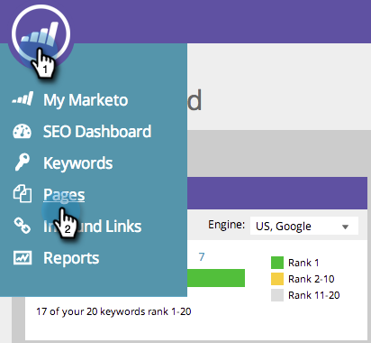

# SEO: aggiungere/rimuovere un problema di pagina da un elenco {#seo-add-remove-page-issue-from-a-list}

Puoi organizzare i problemi relativi alla pagina in elenchi. È inoltre possibile rimuovere i problemi di pagina da un elenco.

## Aggiungere problemi di pagina a un elenco {#add-page-issues-to-a-list}

1. Vai a **[!UICONTROL Pagine]** sezione.

   

1. Il giorno **[!UICONTROL Pagine]** , fare clic su **[!UICONTROL Problemi]**.

   

1. Passa il puntatore del mouse sul problema della pagina che desideri aggiungere. Clic **[!UICONTROL Aggiungi/Rimuovi dall&#39;elenco]**.

   

   Fai clic sull’elenco a cui desideri aggiungere il problema della pagina.

   

   >[!TIP]
   >
   >È inoltre possibile creare un nuovo elenco per la parola chiave da spostare. Digita il nome desiderato in **[!UICONTROL Crea un nuovo elenco]**.

## Rimuovere un problema di pagina da un elenco {#remove-page-issue-from-a-list}

1. Vai a **[!UICONTROL Pagine]** sezione.

   

1. Nella scheda delle pagine, fai clic su **[!UICONTROL Problemi]**.

   

1. Fai clic sull’elenco da organizzare.

   

1. Passa il puntatore del mouse sul problema della pagina da rimuovere. Clic **[!UICONTROL Aggiungi/Rimuovi dall&#39;elenco]**.

   

1. Selezionare l&#39;elenco da organizzare. Fai clic sul nome dell’elenco per rimuovere il problema di pagina da questo elenco.

   

Eccellente! Aggiorna la pagina e non la visualizzerai più nell’elenco.
