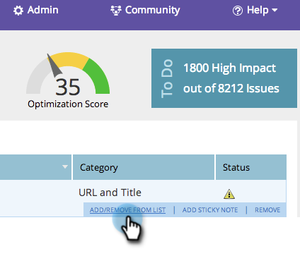

# SEO - Aggiungi/rimuovi problema di pagina da un elenco {#seo-add-remove-page-issue-from-a-list}

Puoi organizzare i problemi della pagina in elenchi. È inoltre possibile rimuovere i problemi di pagina da un elenco.

## Aggiungere problemi di pagina a un elenco {#add-page-issues-to-a-list}

1. Vai a **Pagine** sezione .

   

1. Nella scheda Pagine, fai clic su **Problemi**.

   

1. Passa il puntatore del mouse sul problema della pagina da aggiungere. Fai clic su **Aggiungi/Rimuovi da elenco**.

   

   Fai clic sull’elenco a cui desideri aggiungere il problema della pagina.

   

   >[!TIP]
   >
   >È inoltre possibile creare un nuovo elenco per la parola chiave da utilizzare. Digita il nome desiderato in Crea un nuovo elenco.

## Rimuovere un problema di pagina da un elenco {#remove-page-issue-from-a-list}

1. Vai alla sezione Pagine .

   

1. Nella scheda pagine, fai clic su **Problemi**.

   

1. Fai clic sull’elenco da organizzare.

   

1. Passa il puntatore del mouse sul problema della pagina da rimuovere. Fai clic su **Aggiungi/Rimuovi da elenco**.

   

1. L’elenco che desideri organizzare deve essere selezionato. Fai clic sul nome dell’elenco per rimuovere il problema di pagina da questo elenco.

   

Eccellente! Aggiorna la pagina e non la vedrai più nell&#39;elenco.
