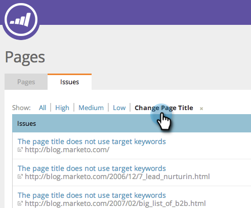

# SEO - Aggiungi/rimuovi edizione pagina da un elenco {#seo-add-remove-page-issue-from-a-list}

Potete organizzare le edizioni delle pagine in elenchi. È inoltre possibile rimuovere le edizioni di pagina da un elenco.

## Aggiungere edizioni di pagina a un elenco {#add-page-issues-to-a-list}

1. Vai alla sezione **Pagine** .

   

1. Nella scheda delle pagine, fate clic su **Problemi**.
1. 

1. Passate il puntatore del mouse sul problema della pagina da aggiungere. Fare clic su **AGGIUNGI/RIMUOVI DA ELENCO**.

   

   Fate clic sull’elenco a cui desiderate aggiungere l’edizione della pagina.
   

   >[!TIP]
   >
   >È inoltre possibile creare un nuovo elenco in cui inserire la parola chiave. Digita il nome desiderato in Create un nuovo elenco.

## Rimuovi edizione pagina da un elenco {#remove-page-issue-from-a-list}

1. Vai alla sezione Pagine.

   

1. Nella scheda delle pagine, fate clic su **Problemi**.

   

1. Fare clic sull&#39;elenco che si desidera organizzare.

   

1. Passate il puntatore del mouse sul problema della pagina da rimuovere. Fare clic su **AGGIUNGI/RIMUOVI DA ELENCO**.

   

1. L&#39;elenco che si desidera organizzare deve essere selezionato. Fate clic sul nome dell’elenco per rimuovere l’edizione della pagina da questo elenco.

   

Eccellente! Aggiorna la pagina e non la visualizzerai più nell’elenco.
