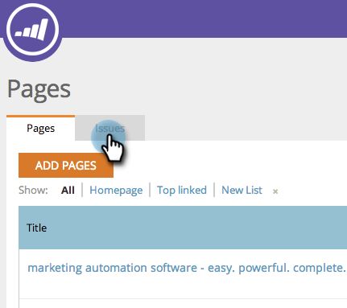

# SEO: aggiungere/rimuovere un problema della pagina da un elenco {#seo-add-remove-page-issue-from-a-list}

Puoi organizzare i problemi relativi alla pagina in elenchi. È inoltre possibile rimuovere i problemi di pagina da un elenco.

>[!IMPORTANT]
>
>Il 31 marzo 2026, Marketo Engage dichiarerà obsoleta la funzione di ottimizzazione dei motori di ricerca. Esportare tutti i dati pertinenti entro e non oltre il 30 marzo. [Ulteriori informazioni](https://nation.marketo.com/t5/product-blogs/marketo-engage-seo-feature-deprecation/ba-p/359060){target="_blank"}.
>
>* [Problemi di esportazione](https://experienceleague.adobe.com/en/docs/marketo/using/product-docs/additional-apps/seo/pages/seo-export-issues-to-csv){target="_blank"}
>* [Esporta risultati parole chiave](https://experienceleague.adobe.com/en/docs/marketo/using/product-docs/additional-apps/seo/keywords/seo-exporting-keyword-results){target="_blank"}
>* [Tendenze parole chiave di esportazione](https://experienceleague.adobe.com/en/docs/marketo/using/product-docs/additional-apps/seo/reports/seo-use-the-keyword-trends-report#exporting-data){target="_blank"}
>* [Esporta tendenze parole chiave concorrenti](https://experienceleague.adobe.com/en/docs/marketo/using/product-docs/additional-apps/seo/reports/seo-use-the-competitor-kw-trends-report#exporting-data){target="_blank"}

## Aggiungere problemi di pagina a un elenco {#add-page-issues-to-a-list}

1. Passare alla sezione **[!UICONTROL Pages]**.

   

1. Nella scheda **[!UICONTROL Pages]**, fare clic su **[!UICONTROL Issues]**.

   

1. Passa il puntatore del mouse sul problema della pagina che desideri aggiungere. Fai clic su **[!UICONTROL Add/Remove From List]**.

   

   Fai clic sull’elenco a cui desideri aggiungere il problema della pagina.

   

   >[!TIP]
   >
   >È inoltre possibile creare un nuovo elenco per la parola chiave da spostare. Digita il nome desiderato in **[!UICONTROL Create a new list]**.

## Rimuovere un problema di pagina da un elenco {#remove-page-issue-from-a-list}

1. Passare alla sezione **[!UICONTROL Pages]**.

   

1. Nella scheda Pagine, fare clic su **[!UICONTROL Issues]**.

   

1. Fai clic sull’elenco da organizzare.

   

1. Passa il puntatore del mouse sul problema della pagina da rimuovere. Fai clic su **[!UICONTROL Add/Remove From List]**.

   

1. Selezionare l&#39;elenco da organizzare. Fai clic sul nome dell’elenco per rimuovere il problema di pagina da questo elenco.

   

Eccellente! Aggiorna la pagina e non la visualizzerai più nell’elenco.
