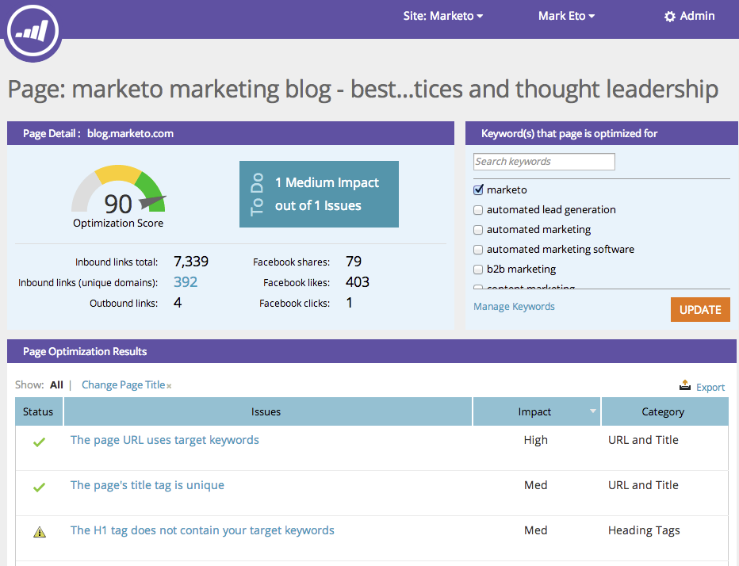

# SEO: utilizzo dell’espansione dei dettagli della pagina {#seo-using-the-page-detail-drill-down}

Puoi visualizzare molte informazioni sulle pagine utilizzando il drill-down dei dettagli.

## Trova espansione pagina {#find-page-drill-down}

1. Vai a **[!UICONTROL Pagine] sezione**.

   

1. Fare clic sulla pagina per la quale si desidera visualizzare i dettagli.

   

   Ecco, la pagina di dettaglio Drill-down!

   

## [!UICONTROL Dettagli pagina] Sezione {#page-detail-section}

| Elemento | Descrizione |
|---|---|
| [!UICONTROL Punteggio ottimizzazione] | La salsa segreta utilizzata per mostrare come la tua pagina è ottimizzata per la ricerca su una scala da 1 a 100. |
| [!UICONTROL Da fare] casella | Visualizza il numero di problemi aperti relativi alla pagina in uso. |
| [!UICONTROL Totale collegamenti in entrata] | Numero totale di collegamenti in entrata al sito Web. |
| [!UICONTROL Collegamenti in entrata (domini univoci)] | Numero di altri siti Web con almeno un collegamento in entrata al sito. |
| [!UICONTROL Collegamenti in uscita] | Il numero di collegamenti che escono da questa pagina verso altri siti Web. |
| [!UICONTROL Condivisioni facebook] | Numero di volte in cui la pagina è stata condivisa [!DNL Facebook]. |
| [!UICONTROL Mi piace facebook] | Numero di volte in cui questa condivisione pagina è stata apprezzata [!DNL Facebook]. |
| [!UICONTROL Clic su facebook] | Numero di clic da [!DNL Facebook share]. |

## [!UICONTROL Parola/e chiave per cui la pagina è ottimizzata] {#keyword-s-that-page-is-optimized-for}

Qui è dove [seleziona la parola chiave per la quale stai tentando di ottimizzare la pagina](/help/marketo/product-docs/additional-apps/seo/keywords/seo-optimize-specific-pages-with-targeted-keywords.md).

>[!NOTE]
>
>Questo è un passaggio importante per ottenere il massimo da questa funzione. È consigliabile utilizzare meno di tre parole chiave per pagina. Idealmente solo uno.

## [!UICONTROL Risultati ottimizzazione pagina] {#page-optimization-results}

Il [!UICONTROL Risultati ottimizzazione pagina] ti dirà i passaggi esatti da intraprendere per aumentare il tuo punteggio di ottimizzazione/ottenere migliori risultati nella ricerca di questa pagina.

>[!MORELIKETHIS]
>
>[Ottimizzare pagine specifiche con parole chiave di destinazione](/help/marketo/product-docs/additional-apps/seo/keywords/seo-optimize-specific-pages-with-targeted-keywords.md)
