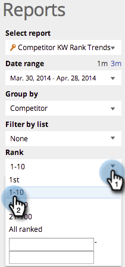

# SEO: utilizzare il rapporto sulle tendenze del KW della concorrenza {#seo-use-the-competitor-kw-trends-report}

In questo rapporto, puoi vedere come tu e i tuoi concorrenti siete classificati in base alle parole chiave nel tempo.

## Trova i Report {#find-reports}

1. Vai a **[!UICONTROL Rapporti]**.

   

1. Clic **[!UICONTROL Tendenze della classifica KW del concorrente]**.

   

## Grafico delle tendenze della classificazione KW {#kw-rank-trends-graph}

Questo grafico può mostrare quale percentuale delle parole chiave viene classificata in un intervallo specificato e come i tuoi concorrenti si accumulano.

| Elemento | Descrizione |
|---|---|
| [!UICONTROL Parole chiave] | Il numero di parole chiave che si stanno tracciando. |
| [!UICONTROL URL di classificazione] | Il numero di URL nella classificazione del sito nell’intervallo impostato. |
| [!UICONTROL % in classifica] | Percentuale di parole chiave che rientrano nell&#39;intervallo impostato. |
| [!UICONTROL Media ricerche] | Il numero medio di ricerche su tali parole chiave che si sono verificate durante l&#39;intervallo impostato (negli ultimi 30 giorni, in Google US search) |

## Filtraggio dei dati {#filtering-data}

1. Fai clic sull’elenco a discesa e seleziona il periodo di tempo desiderato.

   

1. Fai clic su **[!UICONTROL Classifica]** per scegliere per quale intervallo di classificazione si desidera visualizzare le parole chiave.

   

## Esportazione dei dati {#exporting-data}

>[!TIP]
>
>Puoi esportare questo rapporto sul desktop.

1. Clic **[!UICONTROL Esporta CSV]** o **[!UICONTROL Export PDF]**.

   
