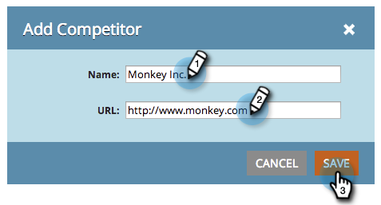

# SEO - Aggiungi concorrenti {#seo-add-competitors}

L’aggiunta di concorrenti consente di tenere traccia delle loro prestazioni per le stesse parole chiave e gli stessi collegamenti in entrata che scegli di monitorare.

>[!NOTE]
>
>**Autorizzazioni amministratore richieste**

1. Vai a **[!UICONTROL Amministratore]** area.

   

1. Fai clic su **[!UICONTROL Concorrenti]** scheda.

   

1. Clic **[!UICONTROL Aggiungi concorrente]**.

   

1. Digita nella **[!UICONTROL Nome]** e **[!UICONTROL URL]** del tuo concorrente.

   

   Ora dovresti vedere il tuo concorrente nell&#39;elenco.

   

   >[!MORELIKETHIS]
   >
   >* [Aggiungi parole chiave](/help/marketo/product-docs/additional-apps/seo/keywords/seo-add-keywords.md){target="_blank"}
   >* [Parole chiave (visualizzazione per i concorrenti)](/help/marketo/product-docs/additional-apps/seo/keywords/seo-understanding-keywords.md){target="_blank"}
