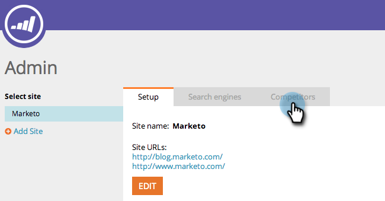
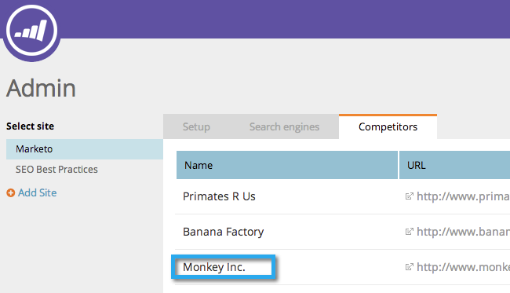

# SEO: aggiungere concorrenti {#seo-add-competitors}

L’aggiunta di concorrenti consente di tenere traccia delle loro prestazioni per le stesse parole chiave e gli stessi collegamenti in entrata che scegli di monitorare.

>[!IMPORTANT]
>
>Il 31 marzo 2026, Marketo Engage dichiarerà obsoleta la funzione di ottimizzazione dei motori di ricerca. Esportare tutti i dati pertinenti entro e non oltre il 30 marzo. [Ulteriori informazioni](https://nation.marketo.com/t5/product-blogs/marketo-engage-seo-feature-deprecation/ba-p/359060){target="_blank"}.
>
>* [Problemi di esportazione](https://experienceleague.adobe.com/it/docs/marketo/using/product-docs/additional-apps/seo/pages/seo-export-issues-to-csv){target="_blank"}
>* [Esporta risultati parole chiave](https://experienceleague.adobe.com/it/docs/marketo/using/product-docs/additional-apps/seo/keywords/seo-exporting-keyword-results){target="_blank"}
>* [Tendenze parole chiave di esportazione](https://experienceleague.adobe.com/it/docs/marketo/using/product-docs/additional-apps/seo/reports/seo-use-the-keyword-trends-report#exporting-data){target="_blank"}
>* [Esporta tendenze parole chiave concorrenti](https://experienceleague.adobe.com/it/docs/marketo/using/product-docs/additional-apps/seo/reports/seo-use-the-competitor-kw-trends-report#exporting-data){target="_blank"}

1. Passa alla schermata **[!UICONTROL Admin]**.

   

1. Fai clic sulla scheda **[!UICONTROL Competitors]**.

   

1. Fai clic su **[!UICONTROL Add Competitor]**.

   

1. Digitare **[!UICONTROL Name]** e **[!UICONTROL URL]** del concorrente.

   

   Ora dovresti vedere il tuo concorrente nell&#39;elenco.

   

   >[!MORELIKETHIS]
   >
   >* [Aggiungi parole chiave](/help/marketo/product-docs/additional-apps/seo/keywords/seo-add-keywords.md){target="_blank"}
   >* [Informazioni sulle parole chiave (visualizzazione della concorrenza)](/help/marketo/product-docs/additional-apps/seo/keywords/seo-understanding-keywords.md){target="_blank"}
