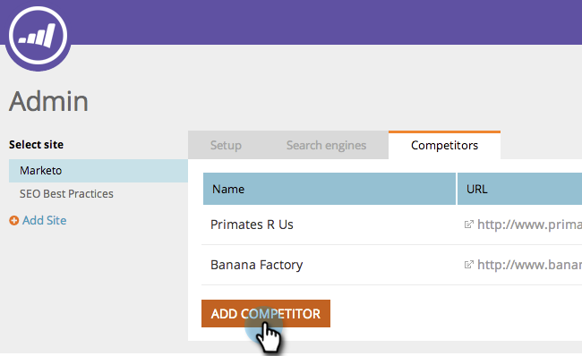

# SEO - Aggiungi concorrenti {#seo-add-competitors}

L’aggiunta di concorrenti ti consentirà di tenere traccia delle prestazioni delle stesse parole chiave e dei collegamenti in entrata che scegli di monitorare.

>[!NOTE]
>
>**Autorizzazioni amministratore richieste**

1. Vai a **Amministratore** sezione .

   

1. Fai clic sul pulsante **Concorrenti** scheda .

   

1. Fai clic su **Aggiungi concorrente**.

   

1. Digita nel **Nome** e **URL** del tuo concorrente.

   

   Cinque in alto! Ora dovresti vedere il tuo concorrente nell&#39;elenco.

   

   Congratulazioni! Sei un passo più vicino a distruggerlo completamente.

   >[!MORELIKETHIS]
   >
   >* [Aggiungi parole chiave](/help/marketo/product-docs/additional-apps/seo/keywords/seo-add-keywords.md){target=&quot;_blank&quot;}
   >* [Parole chiave (visualizzazione concorrente)](/help/marketo/product-docs/additional-apps/seo/keywords/seo-understanding-keywords.md){target=&quot;_blank&quot;}

