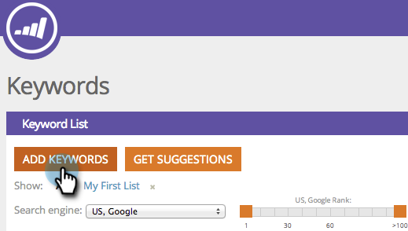

# SEO: gestire gli elenchi {#seo-managing-lists}

È possibile aggiungere elementi agli elenchi quando si aggiungono parole chiave, pagine, problemi di pagina o collegamenti in entrata. Gli elenchi consentono di rimanere organizzati e filtrare i rapporti in modo da visualizzare solo i dati dell’elenco. Ecco come farle.

>[!IMPORTANT]
>
>Il 31 marzo 2026, Marketo Engage dichiarerà obsoleta la funzione di ottimizzazione dei motori di ricerca. Esportare tutti i dati pertinenti entro e non oltre il 30 marzo. [Ulteriori informazioni](https://nation.marketo.com/t5/product-blogs/marketo-engage-seo-feature-deprecation/ba-p/359060){target="_blank"}.
>
>* [Problemi di esportazione](https://experienceleague.adobe.com/en/docs/marketo/using/product-docs/additional-apps/seo/pages/seo-export-issues-to-csv){target="_blank"}
>* [Esporta risultati parole chiave](https://experienceleague.adobe.com/en/docs/marketo/using/product-docs/additional-apps/seo/keywords/seo-exporting-keyword-results){target="_blank"}
>* [Tendenze parole chiave di esportazione](https://experienceleague.adobe.com/en/docs/marketo/using/product-docs/additional-apps/seo/reports/seo-use-the-keyword-trends-report#exporting-data){target="_blank"}
>* [Esporta tendenze parole chiave concorrenti](https://experienceleague.adobe.com/en/docs/marketo/using/product-docs/additional-apps/seo/reports/seo-use-the-competitor-kw-trends-report#exporting-data){target="_blank"}

1. Fai clic su **[!UICONTROL Add Keywords]**.

   >[!NOTE]
   >
   >Funziona allo stesso modo quando si aggiungono pagine, problemi relativi alle pagine e collegamenti in entrata.

   

1. Immettete la parola chiave. Seleziona un elenco a cui aggiungerlo dal menu a discesa.

   

   >[!TIP]
   >
   >Puoi creare un nuovo elenco nel menu a discesa. Inserisci un titolo e premi il tasto Invio.

1. Fai clic su **[!UICONTROL Save]**.

   
