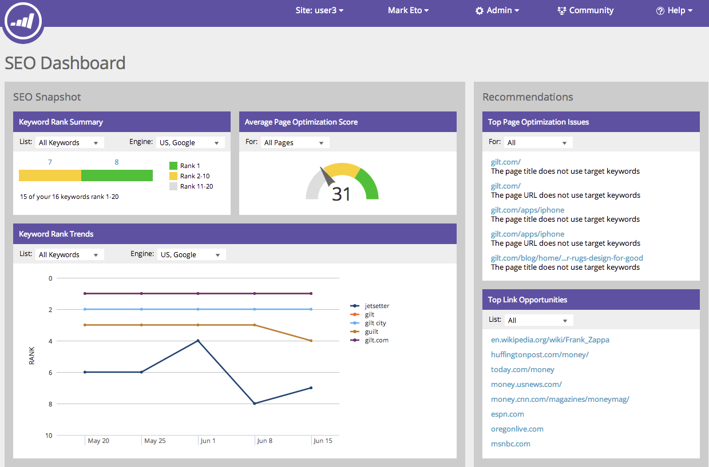

# Informazioni sul dashboard SEO (Search Engine Optimization): SEO Recommendations {#understanding-the-seo-dashboard-seo-recommendations}

Utilizza il dashboard per ottenere una visione di alto livello delle tendenze delle classificazioni delle parole chiave e di quanto il tuo sito sia ottimizzato per SEO.

Puoi anche scoprire come migliorare utilizzando la sezione Recommendations . Intuiamo!

## Problemi principali di ottimizzazione delle pagine {#top-page-optimization-issues}

Questo vi mostrerà cinque modi ad alto impatto per iniziare a ottimizzare il vostro sito immediatamente! Fai clic su uno dei link per visualizzare il [Drill-down dei dettagli della pagina](/help/marketo/product-docs/additional-apps/seo/pages/seo-using-the-page-detail-drill-down.md){target=&quot;_blank&quot;}.

>[!TIP]
>
>Puoi fare clic su Problemi di ottimizzazione della pagina principali per visualizzare un elenco completo.

## Opportunità di collegamento principali {#top-link-opportunities}

L&#39;utilizzo di collegamenti affidabili ai siti ai contenuti può aumentare la classificazione delle pagine. Ecco alcune delle opportunità di priorità più importanti che abbiamo trovato per il tuo sito.

>[!TIP]
>
>Fai clic su Ottimizzazione collegamenti principali per visualizzare un elenco completo.

Andiamo! Vivi più a fondo qui.

>[!MORELIKETHIS]
>
>[Drill-down dei dettagli della pagina](/help/marketo/product-docs/additional-apps/seo/pages/seo-using-the-page-detail-drill-down.md){target=&quot;_blank&quot;}
