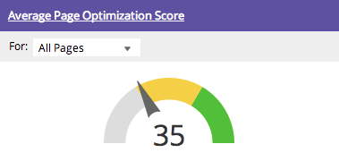

# Informazioni sulla dashboard SEO: istantanea SEO {#understanding-the-seo-dashboard-seo-snapshot}

Utilizza la dashboard per ottenere una visualizzazione di alto livello della tendenza del rango delle parole chiave e dell’ottimizzazione del sito per SEO (Search Engine Optimization).

Per scoprire su cosa concentrarti per migliorare le tue attività SEO, utilizza [[!UICONTROL Recommendations]](/help/marketo/product-docs/additional-apps/seo/understanding-seo/understanding-the-seo-dashboard-seo-recommendations.md) sezione di questo dashboard.

## [!UICONTROL Riepilogo classificazione parole chiave] {#keyword-rank-summary}

Questa sezione mostra come il tuo sito viene classificato per il [parole chiave di destinazione](/help/marketo/product-docs/additional-apps/seo/keywords/seo-add-keywords.md).

| Colore | Classifica |
|---|---|
| Verde | Primo risultato nella ricerca |
| Giallo | 2° - 10° risultato nella ricerca |
| Grigio | 11° - 20° risultato nella ricerca |

>[!TIP]
>
>È inoltre possibile visualizzare come [elenco specifico](/help/marketo/product-docs/additional-apps/seo/keywords/seo-add-remove-keywords-from-a-list.md) di parole chiave in esecuzione. Fai clic sull’elenco a discesa e seleziona quello che ti interessa.

Forza, forza! Continuiamo a muoverci.

## [!UICONTROL Punteggio medio di ottimizzazione pagina] {#average-page-optimization-score}

Il Punteggio medio di ottimizzazione pagina è un punteggio Marketo proprietario che misura tutte le pagine del sito su una scala da 1 a 100.

Si basa su una raccolta di decine di best practice. Un punteggio pari o superiore a 70 indica un sito ben ottimizzato.

>[!TIP]
>
>Puoi anche visualizzare il punteggio di ottimizzazione per elenchi specifici di pagine. Utilizza l’elenco a discesa e selezionane uno che ti interessa.

## [!UICONTROL Tendenze classificazione parole chiave] {#keyword-rank-trends}

Il [!UICONTROL Tendenze classificazione parole chiave] graph richiama le parole chiave con i cinque volumi di ricerca mensili più elevati e genera un grafico che illustra la classificazione nel tempo.

>[!TIP]
>
>È possibile rimuovere le parole chiave dal grafico facendo clic su di esse. Provalo! Il grafico verrà rigenerato in modo dinamico.

Ora diamo un’occhiata al [!UICONTROL Recommendations] sezione di questo dashboard.

>[!MORELIKETHIS]
>
>[Informazioni sulla dashboard: SEO Recommendations](/help/marketo/product-docs/additional-apps/seo/understanding-seo/understanding-the-seo-dashboard-seo-recommendations.md)
