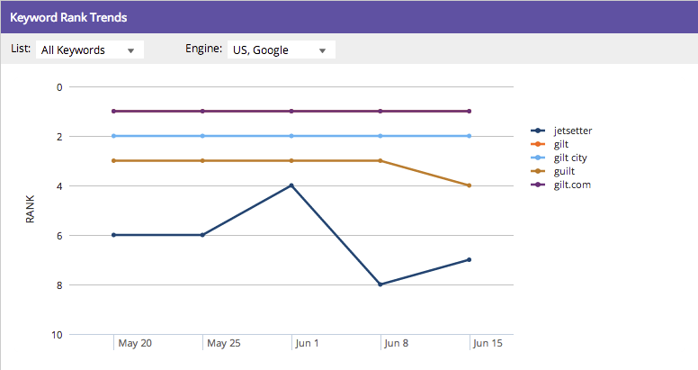

# Informazioni sul dashboard SEO (Search Engine Optimization): Istantanea SEO {#understanding-the-seo-dashboard-seo-snapshot}

Utilizza il dashboard per ottenere una visione di alto livello della tendenza della classificazione delle parole chiave e di quanto il tuo sito sia ottimizzato per SEO.

Per scoprire su cosa concentrarsi per migliorare i tuoi sforzi SEO, utilizza [Recommendations](/help/marketo/product-docs/additional-apps/seo/understanding-seo/understanding-the-seo-dashboard-seo-recommendations.md) di questa dashboard.

## Riepilogo della classificazione delle parole chiave {#keyword-rank-summary}

In questa sezione viene illustrato come il sito è classificato per il [parole chiave di destinazione](/help/marketo/product-docs/additional-apps/seo/keywords/seo-add-keywords.md).

| Colore | Classifica |
|---|---|
| Verde | primo risultato nella ricerca |
| Giallo | 2° - 10° risultato nella ricerca |
| Grigio | 11° - 20° risultato nella ricerca |

>[!TIP]
>
>È inoltre possibile visualizzare un [elenco specifico](/help/marketo/product-docs/additional-apps/seo/keywords/seo-add-remove-keywords-from-a-list.md) delle parole chiave in corso. Fai clic sull’elenco a discesa e seleziona quello che ti interessa.

Forza! Continuiamo a muoverci.

## Punteggio medio di ottimizzazione pagina {#average-page-optimization-score}

Il Punteggio medio di ottimizzazione della pagina è un punteggio Marketo proprietario che misura tutte le pagine del sito su una scala da 1 a 100.

Si basa su una raccolta di dozzine di best practice. Un punteggio di 70 o superiore indica un sito ottimizzato.

>[!TIP]
>
>Puoi anche visualizzare il punteggio di ottimizzazione per specifici elenchi di pagine. Utilizza il menu a discesa e seleziona quello che ti interessa.

## Tendenze della classificazione delle parole chiave {#keyword-rank-trends}

Il grafico delle tendenze della classificazione delle parole chiave richiama le parole chiave con i cinque volumi di ricerca mensili più elevati e genera un grafico in cui viene illustrata la classificazione nel tempo.

>[!TIP]
>
>È possibile rimuovere le parole chiave da questo grafico facendo clic su di esse. Provatela! Il grafico verrà ricostruito in modo dinamico.

Facile, vero? Ora esaminiamo la sezione Recommendations di questo dashboard.

>[!MORELIKETHIS]
>
>[Informazioni sul dashboard: SEO Recommendations](/help/marketo/product-docs/additional-apps/seo/understanding-seo/understanding-the-seo-dashboard-seo-recommendations.md)
