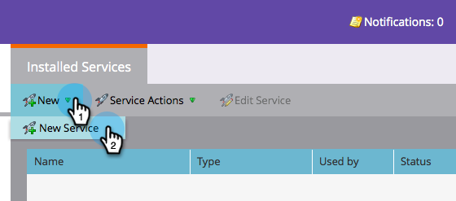

# Aggiungere Adobe Connect as a LaunchPoint Service {#add-adobe-connect-as-a-launchpoint-service}

Marketo gestisce la registrazione e la partecipazione al webinar Adobe Connect.

>[!NOTE]
>
>**Autorizzazioni amministratore richieste**

>[!NOTE]
>
>Per questo passaggio è necessario un abbonamento esistente a Adobe Connect e ai diritti di amministrazione. Disporre delle seguenti impostazioni: nome utente, password, password del partecipante e URL della cartella riunioni.

>[!NOTE]
>
>Adobe Connect On Site non è attualmente supportato.

1. Vai a **Amministratore** e fai clic su **LaunchPoint**.

   

1. Selezionare **Nuovo**, quindi **Nuovo servizio**.

   

1. Immettere un **nome visualizzato**. In **Servizio**, seleziona Adobe Connect.

   

1. Inserisci i **Nome utente** e **Codice di accesso**.

   

1. Completa il processo immettendo l&#39;URL della **Cartella riunioni** e **Password partecipante**, quindi fai clic su **Crea**.

   

   >[!TIP]
   >
   >Quando si crea la password del partecipante, il valore scelto viene incluso in una stringa di interrogazione quando i collegamenti vengono inviati per l’evento. Quindi, ti suggeriamo di renderlo più facile da usare.

   >[!NOTE]
   >
   >Dopo aver effettuato l’accesso al tuo account Adobe Connect, seleziona la scheda **Seminari** . Senza eseguire il drilling verso il basso in un seminario specifico, copia l&#39;URL dalla barra del browser nell&#39;impostazione **URL cartella riunioni**.

Il servizio Adobe Connect è ora sincronizzato con Marketo.

>[!MORELIKETHIS]
>
>Scopri come [creare un evento con Adobe Connect](/help/marketo/product-docs/demand-generation/events/create-an-event/create-an-event-with-adobe-connect.md).
