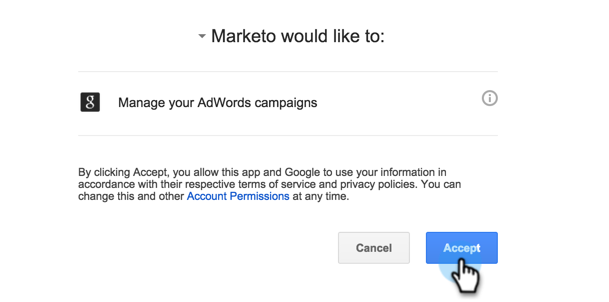
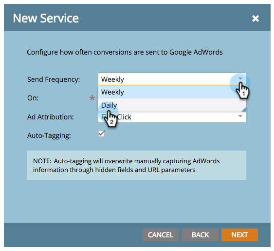

# Aggiungere Google AdWords as a Launchpoint Service con un account Manager {#add-google-adwords-as-a-launchpoint-service-with-a-manager-account}

Collega il tuo account Google AdWords a Marketo per caricare automaticamente i dati di conversione offline da Marketo a Google AdWords. Quindi, dall’interfaccia utente di AdWords, potrai vedere facilmente quali clic hanno portato a lead qualificati, opportunità e nuovi clienti (o qualsiasi fase di ricavo desideri monitorare) dopo aver  [aggiungere colonne personalizzate](https://support.google.com/adwords/answer/3073556) in AdWords. Queste informazioni non vengono visualizzate nell’interfaccia utente di Marketo.

Se disponi di più account Google Adwords, puoi utilizzare un [Account Google AdWords Manager](https://www.google.com/adwords/manager-accounts/) (precedentemente noto come Centro client personale) per integrarli con Marketo.

Ulteriori informazioni [Funzione di importazione della conversione offline di Google](https://support.google.com/adwords/answer/2998031?hl=en).

>[!AVAILABILITY]
>
>Non tutti i clienti hanno acquistato questa funzione. Contatta il tuo Customer Success Manager per i dettagli.

>[!NOTE]
>
>**Autorizzazioni amministratore richieste**

>[!NOTE]
>
>È inoltre possibile integrare un [account Google AdWords autonomo come servizio Launchpoint](/help/marketo/product-docs/administration/additional-integrations/add-google-adwords-as-a-launchpoint-service.md).

1. Vai a **Amministratore** sezione .

   

1. Seleziona **LaunchPoint**.

   

1. Seleziona **Nuovo** e **Nuovo servizio**.

   

1. Immettere un nome visualizzato e selezionare **Google AdWords**.

   

1. Seleziona **Autorizzare Marketo**.

   >[!NOTE]
   >
   >Assicurati di disconnetterti dal tuo account Gmail personale e di abilitare i pop-up.

   

1. Seleziona l&#39;account associato a **Google AdWords**.

   

1. Seleziona **Accetta**.

   

1. Lo stato verrà visualizzato come **Completato**. Seleziona **Successivo**.

   

1. Carica le conversioni offline da Marketo a Google AdWords **Settimanale** o **Giornaliero**.

   

1. Conversione degli attributi in **Primo clic** o **Ultimo clic**.

   | Tipo | Definizione |
   |---|---|
   | Primo clic | Le conversioni offline saranno attribuite ai primi AdWords e che una persona ha fatto clic negli ultimi 90 giorni |
   | Ultimo clic | Le conversioni offline saranno attribuite alle ultime AdWords e una persona ha fatto clic su di esse |

   

   >[!NOTE]
   >
   >[Assegnazione tag automatica](https://support.google.com/adwords/answer/1752125?hl=en) deve essere selezionato per il funzionamento di questa funzione. Deve essere attivato in AdWords.

1. Fai clic su **Successivo**.

   

1. Deselezionare gli account che non si desidera aggiornare. Fai clic su **Crea**.

   

   Ora consulta l’articolo correlato di seguito per scoprire come mappare le conversioni offline di AdWords nel modello di ricavi.

   >[!MORELIKETHIS]
   >
   >[Impostare le conversioni Google AdWords nel modello dei ricavi con un account manager](/help/marketo/product-docs/reporting/revenue-cycle-analytics/revenue-cycle-models/set-google-adwords-conversions-in-the-revenue-model-with-a-manager-account.md)
