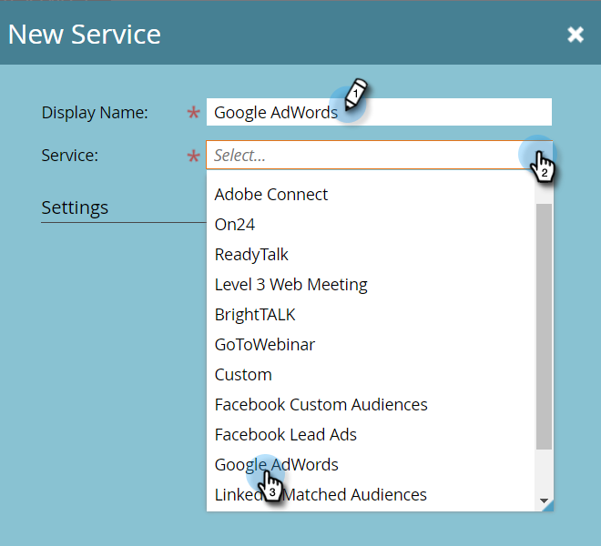
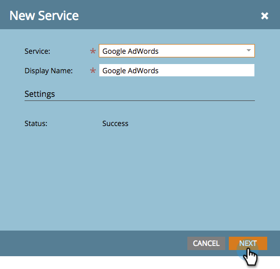
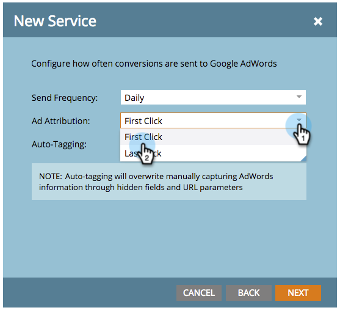

# Aggiungi [!DNL Google AdWords] as a [!DNL Launchpoint] Servizio con un account Manager {#add-google-adwords-as-a-launchpoint-service-with-a-manager-account}

Collega il [!DNL Google AdWords] account in Marketo per caricare automaticamente i dati di conversione offline da Marketo in [!DNL Google AdWords]. Quindi, dalla sezione [!DNL AdWords] Nell’interfaccia utente, potrai vedere facilmente quali clic hanno generato lead qualificati, opportunità e nuovi clienti (o qualsiasi fase dei ricavi desideri monitorare) dopo di te  [aggiungere colonne personalizzate](https://support.google.com/adwords/answer/3073556){target="_blank"} in [!DNL AdWords]. Queste informazioni non vengono visualizzate nell’interfaccia utente di Marketo.

Se sono presenti più [!DNL Google Adwords] account, è possibile utilizzare un [[!DNL Google AdWords Manager Account]](https://www.google.com/adwords/manager-accounts/){target="_blank"} (precedentemente noto come [!DNL My Client Center]) per integrarli con Marketo.

Ulteriori informazioni su [Funzione di importazione della conversione offline di Google](https://support.google.com/adwords/answer/2998031?hl=en){target="_blank"}.

>[!AVAILABILITY]
>
>Non tutti i clienti hanno acquistato questa funzione. Per ulteriori informazioni, contatta l’Adobe Account Team (il tuo Account Manager).

>[!NOTE]
>
>**Autorizzazioni amministratore richieste**

>[!NOTE]
>
>È inoltre possibile integrare [autonomo [!DNL Google AdWords] account as a [!DNL Launchpoint] servizio](/help/marketo/product-docs/administration/additional-integrations/add-google-adwords-as-a-launchpoint-service.md){target="_blank"}.

1. Vai a **[!UICONTROL Amministratore]** area.

   

1. Seleziona **[!UICONTROL LaunchPoint]**.

   

1. Fai clic su **[!UICONTROL Nuovo]** a discesa e selezionare **[!UICONTROL Nuovo servizio]**.

   

1. Immetti un **[!UICONTROL Nome visualizzato]** e seleziona **[!UICONTROL Google AdWords]**.

   

1. Seleziona **[!UICONTROL Autorizza Marketo]**.

   >[!NOTE]
   >
   >Assicurati di uscire dalla pagina personale [!DNL Gmail] e abilitare i popup.

   

1. Seleziona il tuo account associato a **[!DNL Google AdWords]**.

   

1. Clic **[!UICONTROL Accetta]**.

   

1. Lo stato verrà visualizzato come **[!UICONTROL Completato]**. Seleziona **[!UICONTROL Successivo]**.

   

1. Carica le conversioni offline da Marketo a [!DNL Google AdWords] **[!UICONTROL Ogni settimana]** o **[!UICONTROL Giornaliero]**.

   

1. Conversione degli attributi in **[!UICONTROL Primo clic]** o **[!UICONTROL Ultimo clic]**.

   

   | Tipo | Definizione |
   |---|---|
   | [!UICONTROL Primo clic] | Le conversioni offline verranno attribuite al primo [!DNL AdWords] e che una persona ha fatto clic negli ultimi 90 giorni |
   | [!UICONTROL Ultimo clic] | Le conversioni offline verranno attribuite agli ultimi [!DNL AdWords] e che una persona ha fatto clic |

   >[!NOTE]
   >
   >[Assegnazione automatica tag](https://support.google.com/adwords/answer/1752125?hl=en){target="_blank"} deve essere selezionato per il funzionamento di questa funzione. Deve essere attivato all’interno di [!DNL AdWords].

1. Clic **[!UICONTROL Successivo]**.

   

1. Deseleziona gli account da non aggiornare. Fai clic su **[!UICONTROL Crea]**.

   

   Ora consulta l’articolo correlato di seguito per informazioni su come mappare [!DNL AdWords] conversioni offline nel modello di ricavo.

   >[!MORELIKETHIS]
   >
   >[Imposta [!DNL Google AdWords] Conversioni nel modello dei ricavi con un account Manager](/help/marketo/product-docs/reporting/revenue-cycle-analytics/revenue-cycle-models/set-google-adwords-conversions-in-the-revenue-model-with-a-manager-account.md){target="_blank"}
