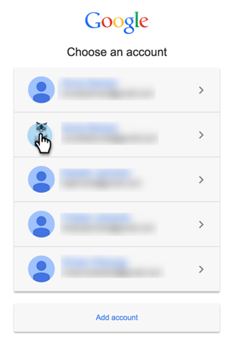

# Aggiungere Google AdWords as a LaunchPoint Service {#add-google-adwords-as-a-launchpoint-service}

Collega il tuo account Google AdWords a Marketo per caricare automaticamente i dati di conversione offline da Marketo a Google AdWords. Quindi, dall’interfaccia utente di AdWords, potrai vedere facilmente quali clic hanno generato lead qualificati, opportunità e nuovi clienti (o qualsiasi fase di ricavo desideri monitorare) dopo aver [aggiungere colonne personalizzate](https://support.google.com/adwords/answer/3073556){target=&quot;_blank&quot;} in AdWords. Queste informazioni non vengono visualizzate nell’interfaccia utente di Marketo.

Ulteriori informazioni [Funzione di importazione della conversione offline di Google](https://support.google.com/adwords/answer/2998031?hl=en){target=&quot;_blank&quot;}.

>[!AVAILABILITY]
>
>Non tutti i clienti hanno acquistato questa funzione. Contatta il tuo Customer Success Manager per i dettagli.

>[!NOTE]
>
>**Autorizzazioni amministratore richieste**

>[!NOTE]
>
>È inoltre possibile integrare un [Servizio Google AdWords as a Launchpoint con un account manager](/help/marketo/product-docs/administration/additional-integrations/add-google-adwords-as-a-launchpoint-service-with-a-manager-account.md){target=&quot;_blank&quot;}.

1. Vai a **Amministratore** sezione .

   

1. Seleziona **LaunchPoint**.

   

1. Seleziona **Nuovo** e **Nuovo servizio**.

   

1. Immettere un nome visualizzato e selezionare **Google AdWords**.

   

1. Seleziona **Autorizzare Marketo**.

   >[!NOTE]
   >
   >Assicurati di disconnetterti dal tuo account Gmail personale e di abilitare i pop-up.

   

1. Seleziona il tuo account associato a Google AdWords.

   

1. Seleziona **Accetta**.

   

1. Lo stato verrà visualizzato come **Completato**. Seleziona **Successivo**.

   

1. Carica le conversioni offline da Marketo a Google AdWords **Settimanale** o **Giornaliero**.

   

1. Conversione degli attributi in **Primo clic** o **Ultimo clic**.

   

   | Tipo | Definizione |
   |---|---|
   | Primo clic | Le conversioni offline saranno attribuite ai primi AdWords e che una persona ha fatto clic negli ultimi 90 giorni |
   | Ultimo clic | Le conversioni offline saranno attribuite alle ultime AdWords e una persona ha fatto clic su di esse |

   >[!NOTE]
   >
   >L’utilizzo di un modello di attribuzione coerente in Marketo e AdWords fornisce i dati più precisi.

1. Fai clic su **Crea**.

   

   >[!NOTE]
   >
   >[Assegnazione tag automatica](https://support.google.com/adwords/answer/1752125?hl=en)È necessario selezionare {target=&quot;_blank&quot;} per il funzionamento di questa funzionalità. La disattivazione deve essere eseguita in AdWords.

Fantastico! Ora consulta l’articolo correlato di seguito per scoprire come mappare le conversioni offline di AdWords nel modello di ricavi.

>[!MORELIKETHIS]
>
>[Impostare le conversioni Google AdWords nel modello di ricavi](/help/marketo/product-docs/reporting/revenue-cycle-analytics/revenue-cycle-models/set-google-adwords-conversions-in-the-revenue-model.md){target=&quot;_blank&quot;}
