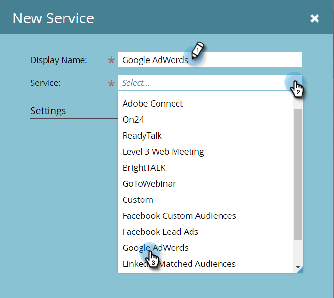

# Aggiungi [!DNL Google AdWords] come servizio [!DNL LaunchPoint] {#add-google-adwords-as-a-launchpoint-service}

Collega l&#39;account [!DNL Google AdWords] a Marketo per caricare automaticamente i dati di conversione offline da Marketo a [!DNL Google AdWords]. Dall&#39;interfaccia utente di [!DNL AdWords], puoi vedere quali clic hanno generato lead qualificati, opportunità e nuovi clienti (o qualsiasi fase dei ricavi desideri monitorare) dopo [aver aggiunto colonne personalizzate](https://support.google.com/adwords/answer/3073556){target="_blank"} in [!DNL AdWords]. Queste informazioni non vengono visualizzate nell’interfaccia utente di Marketo.

Ulteriori informazioni sulla [funzionalità di importazione di conversione offline di Google](https://support.google.com/adwords/answer/2998031?hl=en){target="_blank"}.

>[!AVAILABILITY]
>
>Non tutti gli utenti di Marketo Engage hanno acquistato questa funzionalità. Per informazioni, contatta il team dell’account di Adobe (il tuo Account Manager).

>[!NOTE]
>
>**Autorizzazioni amministratore richieste**

>[!NOTE]
>
>È inoltre possibile integrare un servizio [[!DNL Google AdWords] as a [!DNL Launchpoint]  con un account manager](/help/marketo/product-docs/administration/additional-integrations/add-google-adwords-as-a-launchpoint-service-with-a-manager-account.md){target="_blank"}.

1. Passa alla schermata **[!UICONTROL Admin]**.

   

1. Seleziona **[!UICONTROL LaunchPoint]**.

   

1. Selezionare **[!UICONTROL New]** e **[!UICONTROL New Service]**.

   

1. Immettere un [!UICONTROL display name] e selezionare **[!UICONTROL Google AdWords]**.

   

1. Seleziona **[!UICONTROL Authorize Marketo]**.

   >[!NOTE]
   >
   >Assicurarsi di disconnettersi dall&#39;account [!DNL Gmail] personale e abilitare i popup.

   

1. Seleziona il tuo account associato a [!DNL Google AdWords].

   

1. Seleziona **[!UICONTROL Accept]**.

   

1. Lo stato viene visualizzato come **[!UICONTROL Success]**. Seleziona **[!UICONTROL Next]**.

   

1. Carica le conversioni offline da Marketo a [!DNL Google AdWords] **[!UICONTROL Weekly]** o **[!UICONTROL Daily]**.

   

1. Conversione degli attributi in **[!UICONTROL First Click]** o **[!UICONTROL Last Click]**.

   

   | Tipo | Definizione |
   |---|---|
   | [!UICONTROL First Click] | Le conversioni offline saranno attribuite al primo [!DNL AdWords] e a una persona che ha fatto clic negli ultimi 90 giorni |
   | [!UICONTROL Last Click] | Le conversioni offline saranno attribuite all&#39;ultimo [!DNL AdWords] e che una persona ha fatto clic |

   >[!NOTE]
   >
   >L&#39;utilizzo di un modello di attribuzione coerente in Marketo e [!DNL AdWords] fornisce i dati più precisi.

1. Fai clic su **[!UICONTROL Create]**.

   

   >[!NOTE]
   >
   >[Per il funzionamento di questa funzione è necessario selezionare l&#39;assegnazione automatica tag](https://support.google.com/adwords/answer/1752125?hl=en){target="_blank"}. La disattivazione deve essere eseguita in [!DNL AdWords].

Consulta l&#39;articolo correlato di seguito per scoprire come mappare [!DNL AdWords] conversioni offline nel tuo modello di ricavi.
