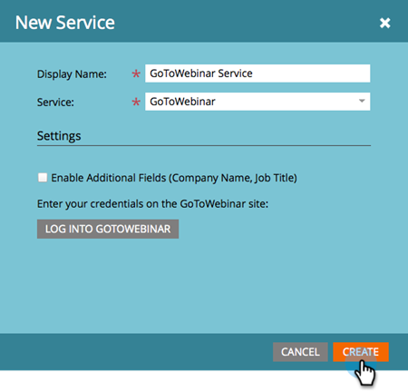

# Aggiungi GoToWebinar come servizio LaunchPoint {#add-gotowebinar-as-a-launchpoint-service}

Marketo gestisce la registrazione e la partecipazione GoToWebinar.

>[!NOTE]
>
>**Autorizzazioni amministratore richieste**

>[!NOTE]
>
>Per questo passaggio è necessaria una sottoscrizione esistente a GoToWebinar e diritti di amministrazione. Avere a portata di mano l&#39;e-mail e la password che si utilizza per accedere a GoToWebinar.

>[!NOTE]
>
>GoToMeeting, GoToWebcast e GoToTraining non sono attualmente supportati.

1. Vai a **Amministratore** area.

   

1. Fai clic su **LaunchPoint**.

   

1. Seleziona **Nuovo** e **Nuovo servizio**.

   

1. Inserisci un **Nome visualizzato**. Sotto **Servizio**, seleziona **Webinar GoTo**.

   

1. Quindi, fai clic su **Accedi a GoToWebinar**.

   

   >[!NOTE]
   >
   >Se desideri sincronizzare Nome società e Titolo processo dal modulo Marketo a GoToWebinar, seleziona la **Abilita campi aggiuntivi** scatola.

1. Nella finestra a comparsa Accesso GoToWebinar, immetti il tuo **Webinar GoTo** e-mail e password e fai clic su **Accesso**.

   

1. Dopo la chiusura della finestra, fai clic su **Crea**.

   

1. Fantastico! Le **Webinar GoTo** l&#39;account è ora sincronizzato con Marketo.

   

>[!CAUTION]
>
>Quando aggiorni la password in GoToWebinar, devi aggiornare anche la password in Marketo.

>[!MORELIKETHIS]
>
>Scopri come [creare un evento con GotoWebinar](/help/marketo/product-docs/demand-generation/events/create-an-event/create-an-event-with-gotowebinar.md){target=&quot;_blank&quot;}.
