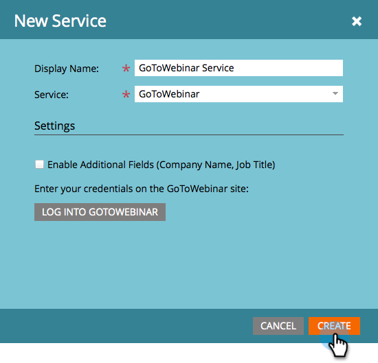

# Aggiungi GoToWebinar come servizio LaunchPoint {#add-gotowebinar-as-a-launchpoint-service}

Marketo gestisce la registrazione e la partecipazione GoToWebinar.

>[!NOTE]
>
>**Autorizzazioni amministratore richieste**

>[!NOTE]
>
>Per questo passaggio è necessaria una sottoscrizione esistente a GoToWebinar e diritti di amministrazione. Avere a portata di mano l&#39;e-mail e la password che si utilizza per accedere a GoToWebinar.

>[!NOTE]
>
>GoToMeeting, GoToWebcast e GoToTraining non sono attualmente supportati.

1. Vai a **Amministratore** e seleziona **LaunchPoint**.

   

1. Selezionare **Nuovo** e **Nuovo servizio**.

   

1. Immettere un **nome visualizzato**. In **Servizio**, seleziona **GoToWebinar**.

   

1. Quindi, fai clic su **Accedi a GoToWebinar**.

   

   >[!NOTE]
   >
   >Se desideri sincronizzare Nome società e Titolo processo dal modulo Marketo a GoToWebinar, seleziona la casella **Abilita campi aggiuntivi**.

1. Nella finestra a comparsa Accesso GoToWebinar, immetti l&#39;e-mail e la password **GoToWebinar** e fai clic su **Accedi**.

   

1. Una volta chiusa la finestra, fai clic su **Crea**.

   

1. Fantastico! L&#39;account **GoToWebinar** è ora sincronizzato con Marketo.

   

>[!CAUTION]
>
>Quando aggiorni la password in GoToWebinar, devi aggiornare anche la password in Marketo.

>[!MORELIKETHIS]
>
>Scopri come [creare un evento con GotoWebinar](/help/marketo/product-docs/demand-generation/events/create-an-event/create-an-event-with-gotowebinar.md).
