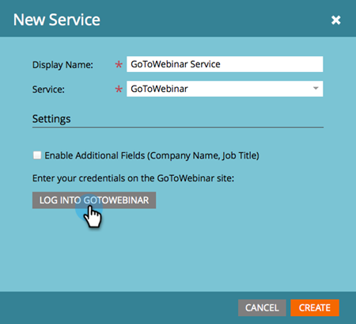

# Aggiungi [!DNL GoToWebinar] come servizio [!DNL LaunchPoint] {#add-gotowebinar-as-a-launchpoint-service}

Marketo gestisce la registrazione e la partecipazione a [!DNL GoToWebinar].

>[!NOTE]
>
>**Autorizzazioni amministratore richieste**

>[!NOTE]
>
>Per questo passaggio sono necessari un abbonamento esistente a [!DNL GoToWebinar] e diritti di amministrazione. Disponi dell&#39;e-mail e della password che utilizzi per accedere a [!DNL GoToWebinar].

>[!NOTE]
>
>[!DNL GoToMeeting], [!DNL GoToWebcast] e [!DNL GoToTraining] non sono attualmente supportati.

1. Passa alla schermata **[!UICONTROL Admin]**.

   

1. Fai clic su **[!UICONTROL LaunchPoint]**.

   

1. Selezionare **[!UICONTROL New]** e **[!UICONTROL New Service]**.

   

1. Immetti **[!UICONTROL Display Name]**. In **[!UICONTROL Service]**, selezionare **[!UICONTROL GoToWebinar]**.

   

1. Fai clic su **[!UICONTROL Log Into GoToWebinar]**.

   

   >[!NOTE]
   >
   >If you want to sync Company Name and Job Title from your Marketo form to [!DNL GoToWebinar], select the **[!UICONTROL Enable Additional Fields]** box.

1. In the [!DNL GoToWebinar] Sign In pop-up window, enter your **[!UICONTROL GoToWebinar]** email and password and click **[!UICONTROL Sign In]**.

   

1. Dopo la chiusura della finestra, fare clic su **[!UICONTROL Create]**.

   

1. L&#39;account **[!UICONTROL GoToWebinar]** è ora sincronizzato con Marketo.

   

>[!CAUTION]
>
>Quando si aggiorna la password in [!DNL GoToWebinar], è necessario aggiornare anche la password in Marketo.

>[!MORELIKETHIS]
>
>Scopri come [creare un evento con [!DNL GotoWebinar]](/help/marketo/product-docs/demand-generation/events/create-an-event/create-an-event-with-gotowebinar.md){target="_blank"}.
