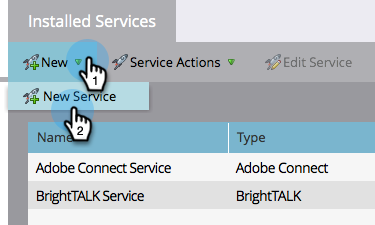

# Aggiungi [!DNL GoToWebinar] as a [!DNL LaunchPoint] Servizio {#add-gotowebinar-as-a-launchpoint-service}

Marketo gestisce [!DNL GoToWebinar] registrazione e partecipazione.

>[!NOTE]
>
>**Autorizzazioni amministratore richieste**

>[!NOTE]
>
>Un abbonamento esistente a [!DNL GoToWebinar] e i diritti di amministrazione sono necessari per questa fase. Avere l&#39;indirizzo e-mail e la password utilizzati per accedere a [!DNL GoToWebinar] a portata di mano.

>[!NOTE]
>
>[!DNL GoToMeeting], [!DNL GoToWebcast], e [!DNL GoToTraining] non sono attualmente supportati.

1. Vai a **[!UICONTROL Amministratore]** area.

   

1. Clic **[!UICONTROL LaunchPoint]**.

   

1. Seleziona **[!UICONTROL Nuovo]** e **[!UICONTROL Nuovo servizio]**.

   

1. Immetti un **[!UICONTROL Nome visualizzato]**. Sotto **[!UICONTROL Servizio]**, seleziona **[!UICONTROL Webinar GoTo]**.

   

1. Clic **[!UICONTROL Accedi al webinar GoTo]**.

   

   >[!NOTE]
   >
   >Se si desidera sincronizzare il nome della società e la posizione lavorativa dal modulo Marketo a [!DNL GoToWebinar], seleziona la **[!UICONTROL Abilita campi aggiuntivi]** casella.

1. In [!DNL GoToWebinar] Finestra popup di accesso, immettere **[!UICONTROL Webinar GoTo]** e-mail e password e fai clic su **[!UICONTROL Accedi]**.

   

1. Dopo aver chiuso la finestra, fai clic su **[!UICONTROL Crea]**.

   

1. Fantastico! Il tuo **[!UICONTROL Webinar GoTo]** l’account è ora sincronizzato con Marketo.

   

>[!CAUTION]
>
>Quando aggiorni la password in [!DNL GoToWebinar], è necessario aggiornare la password anche in Marketo.

>[!MORELIKETHIS]
>
>Scopri come [creare un evento con [!DNL GotoWebinar]](/help/marketo/product-docs/demand-generation/events/create-an-event/create-an-event-with-gotowebinar.md){target="_blank"}.
