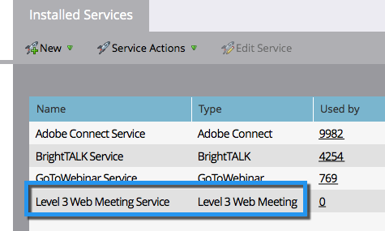

# Aggiungi riunione Web di livello 3 come servizio LaunchPoint {#add-level-three-web-meeting-as-a-launchpoint-service}

Marketo gestisce la registrazione e la partecipazione a riunioni Web di livello 3.

>[!NOTE]
>
>**Autorizzazioni amministratore richieste**

>[!NOTE]
>
>Per questo passaggio è necessaria una sottoscrizione esistente a diritti di riunione e amministrazione Web di livello 3. Avere a portata di mano il numero di accesso, il codice di accesso e il codice di accesso.

1. Vai a **Amministratore** area.

   

1. Fai clic su **LaunchPoint**.

   

1. Seleziona **Nuovo** e poi **Nuovo servizio**.

   

1. Inserisci un **Nome visualizzato**. Sotto **Servizio**, seleziona **Riunione Web di livello 3**.

   

1. Inserisci il tuo **Numero di accesso**, **Codice di accesso** e **Passcode**, quindi fai clic su **Crea**.

   

L&#39;account della riunione Web di livello 3 è ora sincronizzato con Marketo.

>[!MORELIKETHIS]
>
>Scopri come [creare un evento con una riunione Web di livello 3](/help/marketo/product-docs/demand-generation/events/create-an-event/create-an-event-with-level-3-web-meeting.md){target=&quot;_blank&quot;}.
