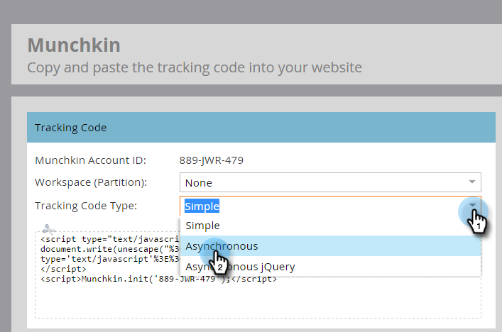
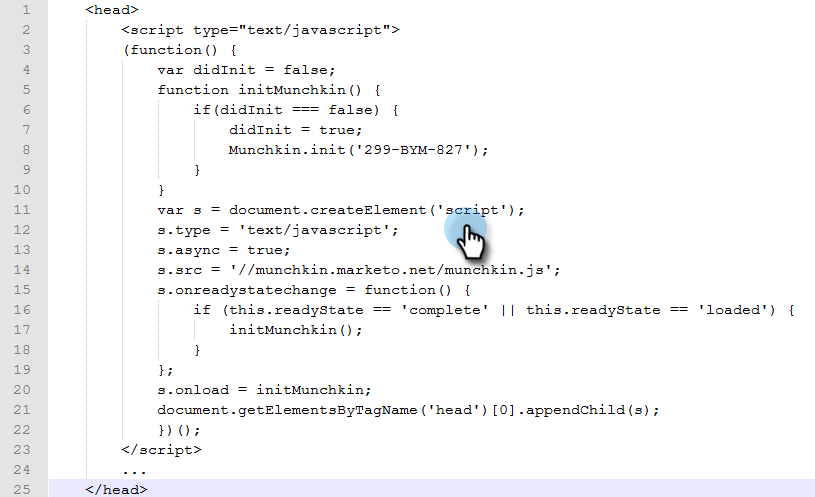
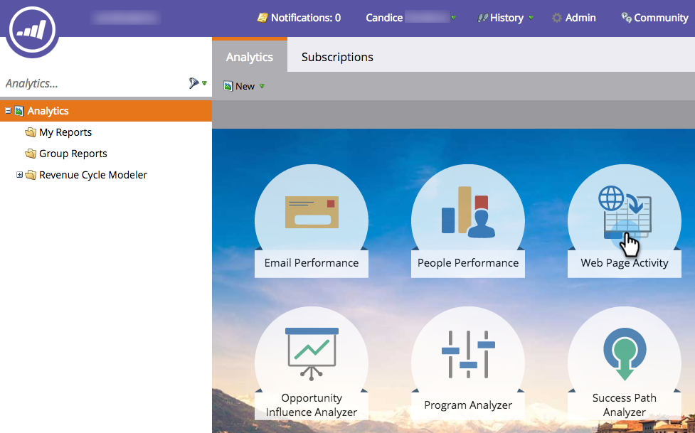

# Aggiungi il codice di tracciamento Munchkin al tuo sito web {#add-munchkin-tracking-code-to-your-website}

Il codice di tracciamento JavaScript personalizzato di Marketo, denominato Munchkin, tiene traccia di tutti gli utenti che visitano il tuo sito web in modo da poter reagire alle loro visite con campagne di marketing automatizzate. Anche i visitatori anonimi vengono tracciati insieme ai loro indirizzi IP e altre informazioni. **Senza questo codice di tracciamento, non potrai tenere traccia di visite o altre attività sul tuo sito web**!

>[!PREREQUISITES]
>
>Assicurati di avere accesso a uno sviluppatore JavaScript esperto. Il supporto tecnico Marketo non è configurato per fornire assistenza nella risoluzione dei problemi relativi a JavaScript personalizzati.

## Aggiungi il codice di tracciamento al tuo sito web {#add-tracking-code-to-your-website}

>[!NOTE]
>
>I clienti Adobe Experience Cloud possono inoltre utilizzare l’integrazione Marketo in Adobe Launch per includere lo script Munchkin nelle proprie pagine web. Scarica l&#39;app [qui](https://www.adobeexchange.com/experiencecloud.details.101054.html).

1. Vai a **Amministratore** e fai clic su **Munchkin** nella struttura a sinistra.

   

   Seleziona asincrono per il tipo di codice di tracciamento.

   

   >[!NOTE]
   >
   >In quasi tutti i casi, utilizza il codice asincrono. [Per saperne di più.](#types-of-munchkin-tracking-codes)

   Fai clic su e copia il codice di tracciamento Javascript da inserire nel tuo sito web.

   

   >[!CAUTION]
   >
   >Non utilizzare il codice mostrato in questa schermata - devi usare il codice univoco che appare nel tuo account!

   >[!TIP]
   >
   >Inserisci il codice di tracciamento sulle pagine web che desideri monitorare. Può trattarsi di ogni pagina per siti più piccoli, o solo di pagine chiave per siti con molte pagine Web generate in modo dinamico, forum utente e così via.

   Per risultati ottimali, utilizza il codice Munchkin asincrono e inseriscilo all’interno degli elementi `<head>` delle tue pagine. Se utilizzi un codice semplice (non consigliato), questo è immediatamente prima del tag `</body>` .
   

>[!TIP]
>
>Per i siti che vedono un elevato volume di traffico (ovvero centinaia di migliaia di visite al mese), ti consigliamo di non tenere traccia di persone anonime. [Ulteriori informazioni](https://developers.marketo.com/documentation/websites/lead-tracking-munchkin-js/).

## Aggiungi il codice di tracciamento quando utilizzi più aree di lavoro {#add-tracking-code-when-using-multiple-workspaces}

Se utilizzi le aree di lavoro nel tuo account Marketo, probabilmente hai anche diverse presenze web che corrispondono alle tue aree di lavoro. In questo caso, è possibile utilizzare il Javascript di tracciamento Munchkin per assegnare le persone anonime all&#39;area di lavoro e alla partizione corrette.

1. Vai a **Amministratore** e fai clic su **Munchkin** nella struttura a sinistra.

1. Selezionare l’area di lavoro appropriata per le pagine Web da monitorare.

   

>[!NOTE]
>
>Se non si utilizza il codice speciale dell&#39;area di lavoro Munchkin, le persone verranno assegnate alla partizione predefinita creata al momento della configurazione dell&#39;account. Inizialmente si chiama &quot;Predefinito&quot;, ma potreste aver modificato questo valore nel vostro account Marketo.

1. Seleziona **Asincrono** per il tipo di codice di tracciamento.

   

1. Fai clic su e copia il codice di tracciamento JavaScript da inserire nel tuo sito web.

   

   >[!CAUTION]
   >
   >Non utilizzare il codice mostrato in questa schermata - devi usare il codice univoco che appare nel tuo account!

1. Inserisci il codice di tracciamento sulle pagine web nell’elemento `<head>` . Le nuove persone che visitano questa pagina verranno assegnate a questa partizione.

   

>[!CAUTION]
>
>È possibile utilizzare un solo script di tracciamento Munchkin per una singola partizione e area di lavoro su una pagina. Non includere script di tracciamento per più partizioni/aree di lavoro sul sito web.

>[!NOTE]
>
>Le pagine di destinazione create in Marketo contengono automaticamente un codice di tracciamento, pertanto non è necessario inserirvi questo codice.

## Tipi di codici di tracciamento Munchkin {#types-of-munchkin-tracking-codes}

Ci sono tre tipi di codici di tracciamento Munchkin tra cui puoi scegliere. Ogni modifica influisce in modo diverso sui tempi di caricamento delle pagine web.

1. **Semplice**: presenta il minor numero di righe di codice, ma non ottimizza il tempo di caricamento della pagina web. Questo codice carica la libreria jQuery ogni volta che viene caricata una pagina web.
1. **Asincrono**: riduce il tempo di caricamento della pagina web.
1. **jQuery** asincrona: riduce il tempo di caricamento delle pagine web e migliora anche le prestazioni del sistema. Questo codice presuppone che tu abbia già jQuery e non controlla di caricarla.

## Verifica se il tuo codice Munchkin funziona {#test-if-your-munchkin-code-is-working}

Per verificare che il codice Munchkin funzioni dopo averlo aggiunto:

1. Visita la tua pagina web.

1. Vai a **Analytics**.

   

1. Fare clic su **Attività pagina Web**.

   

1. Fai clic sulla scheda **Configurazione**, fai doppio clic su **Origine attività** e modificala in **Visitatori anonimi (inclusi gli ISP)**.

   

   

1. Fare clic sulla scheda **Rapporto**. Se non trovi dati, attendi alcuni minuti, quindi fai clic sull’icona di aggiornamento in basso.
