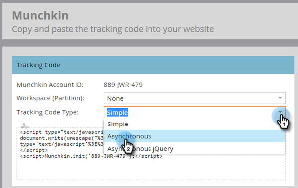
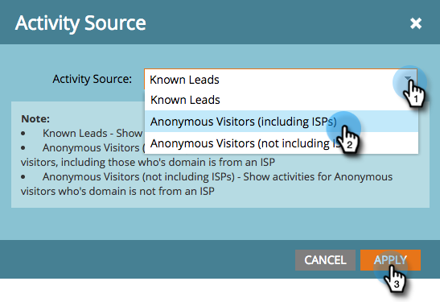
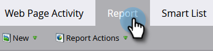

# Add [!DNL Munchkin] Tracking Code to Your Website {#add-munchkin-tracking-code-to-your-website}

Marketo&#39;s custom JavaScript tracking code, called [!DNL Munchkin], tracks all individuals who visit your website so you can react to their visits with automated marketing campaigns. Even anonymous visitors are tracked along with their IP addresses and other information. **Without this tracking code, you will not be able to track visits or other activity on your website**!

>[!PREREQUISITES]
>
>Ensure you have access to an experienced JavaScript developer. Il supporto tecnico Marketo non è configurato per fornire assistenza nella risoluzione dei problemi relativi al JavaScript personalizzato.

## Aggiungere il codice di tracciamento al tuo sito web {#add-tracking-code-to-your-website}

>[!NOTE]
>
>Adobe Experience Cloud users can also use the [Marketo integration in Adobe Launch](https://exchange.adobe.com/apps/ec/100223/adobe-launch-core-extension){target="_blank"} to include [!DNL Munchkin] script on their web pages. If you use Adobe Launch, _the [!DNL Munchkin] script gets added automatically_, so you would not need to add it yourself.

1. Passa alla schermata **[!UICONTROL Admin]**.

   

1. Fai clic su **[!UICONTROL Munchkin]**.

   

1. Select **[!UICONTROL Asynchronous]** for **[!UICONTROL Tracking Code Type]**.

   

   >[!NOTE]
   >
   >In almost all cases, you should use the asynchronous code. [Ulteriori informazioni](#types-of-munchkin-tracking-codes).

1. Copy the JavaScript tracking code to add to your website.

   

   >[!CAUTION]
   >
   >Do not use the code shown in this screenshot - you must use the unique code that appears in your account.

   >[!TIP]
   >
   >Put tracking code on the web pages you want to track. This may be every page for smaller sites, or only key pages on sites that have many dynamically generated Web pages, user forums, and so on.

   For best results, use the asynchronous [!DNL Munchkin] code and place it inside the `<head>` elements of your pages. If you are using the simple code (not recommended), this is right before the `</body>` tag.

   

   >[!TIP]
   >
   >For sites that see a high volume of traffic (that is, hundreds of thousands of visits per month), it is recommended you opt not to track anonymous people. [Ulteriori informazioni](https://experienceleague.adobe.com/it/docs/marketo-developer/marketo/javascriptapi/leadtracking/lead-tracking){target="_blank"}.

## Add Tracking Code When Using Multiple Workspaces {#add-tracking-code-when-using-multiple-workspaces}

If you are using Workspaces in your Marketo account, you probably also have separate web presences that correspond to your workspaces. In that case, you can use the [!DNL Munchkin] tracking Javascript to assign your anonymous people to the correct workspace and partition.

1. Passa alla schermata **[!UICONTROL Admin]**.

   

1. Fai clic su **[!UICONTROL Munchkin]**.

   

1. Select the appropriate workspace for the web pages you wish to track.

   

   >[!NOTE]
   >
   >If you do not use the special workspace [!DNL Munchkin] code, the people will be assigned to the default partition that was created when your account was set up. Il nome è &#39;[!UICONTROL Default]&#39; per impostazione predefinita, ma è possibile che sia stato modificato.

1. Selezionare **[!UICONTROL Asynchronous]** per **[!UICONTROL Tracking Code Type]**.

   

1. Copia il codice di tracciamento JavaScript da aggiungere al sito web.

   

   >[!CAUTION]
   >
   >Non utilizzare il codice mostrato in questa schermata: devi utilizzare il codice univoco visualizzato nel tuo account.

1. Inserire il codice di tracciamento nelle pagine Web nell&#39;elemento `<head>`. Le nuove persone che visitano questa pagina vengono assegnate a questa partizione.

   

   >[!CAUTION]
   >
   >È possibile utilizzare un solo script di tracciamento [!DNL Munchkin] per una singola partizione e area di lavoro in una pagina. Non includere script di tracciamento per più partizioni/aree di lavoro nel sito Web.

   >[!NOTE]
   >
   >Le pagine di destinazione create in Marketo contengono automaticamente il codice di tracciamento. Non è necessario aggiungervi questo codice.

## Tipi di codici di tracciamento [!DNL Munchkin] {#types-of-munchkin-tracking-codes}

È possibile scegliere tra tre tipi di codici di tracciamento [!DNL Munchkin]. Ciascuno influisce sui tempi di caricamento della pagina web in modo diverso.

1. **[!UICONTROL Simple]**: ha il minor numero di righe di codice, ma non è ottimizzato per il tempo di caricamento della pagina Web. Questo codice carica la libreria jQuery ogni volta che viene caricata una pagina Web.
1. **[!UICONTROL Asynchronous]**: riduce il tempo di caricamento della pagina Web.
1. **[!UICONTROL Asynchronous jQuery]**: riduce il tempo di caricamento della pagina Web e migliora le prestazioni del sistema. Questo codice presuppone che tu disponga già di jQuery e non controlla di caricarlo.

## Verifica se il codice [!DNL Munchkin] funziona {#test-if-your-munchkin-code-is-working}

Per verificare che il codice [!DNL Munchkin] funzioni dopo averlo aggiunto:

1. Visita la tua pagina web.

1. In [!DNL My Marketo], fare clic sul riquadro **[!UICONTROL Analytics]**.

   

1. Fai clic su **[!UICONTROL Web Page Activity]**.

   

1. Fare clic sulla scheda **[!UICONTROL Setup]**, quindi fare doppio clic su **[!UICONTROL Activity Source]**.

   

1. Modificare [!UICONTROL Activity Source] in **[!UICONTROL Anonymous Visitors (including ISPs)]** e fare clic su **[!UICONTROL Apply]**.

   

1. Fai clic sulla scheda **[!UICONTROL Report]**.

   

   >[!NOTE]
   >
   >Se non trovi dati, attendi alcuni minuti, quindi fai clic sull&#39;icona [!UICONTROL refresh] in basso.
