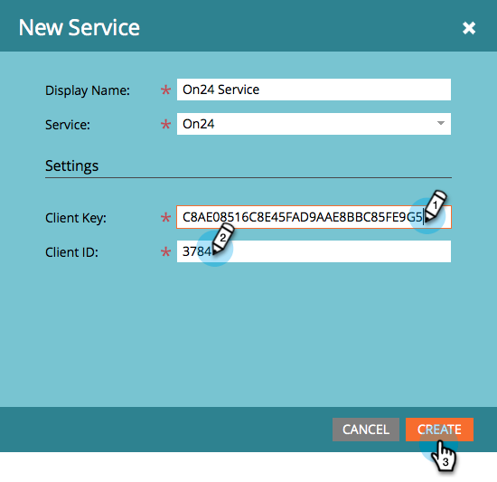

# Aggiungi ON24 come servizio LaunchPoint {#add-on-as-a-launchpoint-service}

Marketo gestisce la registrazione e la partecipazione al webinar ON24.

>[!NOTE]
>
>**Autorizzazioni amministratore richieste**

>[!NOTE]
>
>Per questo passaggio è necessario un abbonamento esistente a ON24 e ai diritti di amministrazione. Disporre delle seguenti impostazioni: Chiave client e ID client. Puoi ottenere l&#39;ID cliente e la chiave client direttamente dal tuo Account Manager ON24.

1. Vai a **Amministratore** e fai clic su **LaunchPoint**.

   

1. Selezionare **Nuovo**, quindi **Nuovo servizio**.

   

1. Immettere un **nome visualizzato**. In **Servizio**, selezionare **ON24**.

   

1. Completa il processo immettendo la **Chiave client** e **ID client** in **Impostazioni**, quindi fai clic su **Crea**.

   

1. L&#39;account **ON24** è ora sincronizzato con Marketo.

   

>[!MORELIKETHIS]
>
>Scopri come [creare il tuo evento webinar in ON24](/help/marketo/product-docs/demand-generation/events/create-an-event/create-an-event-with-the-marketo-on24-adapter/create-your-webinar-event-in-on24.md).
