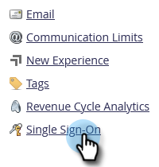

# Aggiungere Single Sign-On a un portale {#add-single-sign-on-to-a-portal}

Se disponi di un servizio di directory che autentica gli utenti, puoi consentire l’accesso single sign-on (SSO) in Marketo. Supportiamo questa funzione utilizzando la versione 2.0 o successiva di Security Assertion Markup Language (SAML).

Marketo funziona come provider di servizi SAML (SP) e dipende da un provider di identità esterno (IdP) per autenticare gli utenti.

Una volta abilitato SSO, l&#39;IdP può convalidare le credenziali di un utente. Quando un utente desidera utilizzare il software Marketo, l&#39;IdP invia quindi un messaggio SAML firmato a Marketo, agendo come SP. Questo messaggio garantisce a Marketo che l&#39;utente è autorizzato a utilizzare il software Marketo.

>[!NOTE]
>
>**Autorizzazioni amministratore richieste**

>[!NOTE]
>
>Sei un utente di Microsoft Azure? Consulta le loro [esercitazione sull&#39;integrazione](https://azure.microsoft.com/en-us/documentation/articles/active-directory-saas-marketo-tutorial/){target=&quot;_blank&quot;}.

## Come inviare la richiesta {#how-to-send-the-request}

* Invia la richiesta SSO, che è una risposta SAML, a `https://login.marketo.com/saml/assertion/<your-munchkin-id>`
* Come URL del pubblico dell&#39;SP. Utilizzo `http://saml.marketo.com/sp`
* Se utilizzi l’attributo SPNameQualifier, imposta l’elemento NameID per Subject su `http://saml.marketo.com/sp`
* Se stai federando più abbonamenti Marketo allo stesso provider SSO, puoi utilizzare url SP univoci per ogni sottomodulo Marketo con il formato `http://saml.marketo.com/sp/<munchkin_id>`

>[!NOTE]
>
>Marketo supporta solo l’avvio del provider di identità (noto anche come avviato da IdP), in cui l’utente avvia per la prima volta la pagina di accesso Idp, si autentica e quindi passa a My Marketo.

## Note aggiuntive {#additional-notes}

* **Tempo di sincronizzazione** - Per un nuovo utente, si verifica un ritardo di circa 10 minuti prima dell&#39;elaborazione di una richiesta SSO iniziale.
* **Provisioning utente** - Il provisioning degli utenti viene eseguito manualmente da Marketo.
* **Autorizzazione** - Le autorizzazioni utente vengono mantenute in Marketo.
* **Supporto OAuth** - Al momento Marketo non supporta OAuth.
* **Propagazione automatica utente** - Noto anche come &quot;Just in Time Provisioning&quot;, quando il primo accesso SAML di un utente è in grado di creare l&#39;utente in qualsiasi applicazione web a cui accede (ad esempio, Marketo) e non è necessaria alcuna azione manuale di amministrazione. Al momento Marketo non supporta questa funzionalità.
* **Crittografia** - Marketo non supporta attualmente la crittografia.

>[!NOTE]
>
>Prima di iniziare, chiedi al certificato del provider di identità in formato X.509 e con estensione crt, der o cer.

## Aggiorna impostazioni SAML {#update-saml-settings}

SSO è disattivato per impostazione predefinita. Segui questi passaggi per abilitare SAML e configurarlo.

1. Vai a **Amministratore** area.

   

1. Fai clic su **Single Sign-On**.

   

   >[!NOTE]
   >
   >Se non vedi **Single Sign-On** sotto **Amministratore**, contatto [Supporto Marketo](https://nation.marketo.com/t5/Support/ct-p/Support){target=&quot;_blank&quot;}.

1. Sotto la **Impostazioni SAML** sezione, fai clic su **Modifica**.

   

1. Modifica **Single Sign-On SAML** a **Abilitato**.

   

1. Inserisci il tuo **ID emittente**, **ID entità**, seleziona **Posizione ID utente**, quindi fai clic su **Sfoglia**.

   

1. Seleziona la tua **Certificato del fornitore di identità** file.

   

1. Fai clic su **Salva**.

   

## Aggiorna impostazioni pagina di reindirizzamento {#update-redirect-page-settings}

1. Sotto la **Reindirizza pagine** sezione, fai clic su **Modifica**.

   

   >[!NOTE]
   >
   >I clienti che utilizzano l’ID universale insieme all’SSO devono immettere l’URL di accesso del provider di identità nel **URL di accesso** campo .

1. Inserisci un **URL di disconnessione**. Questo è l&#39;URL a cui si desidera indirizzare l&#39;utente quando si disconnette da Marketo.

   

1. Inserisci un **URL errore**. Questo è l&#39;URL a cui si desidera indirizzare l&#39;utente nel caso in cui l&#39;accesso a Marketo non riesca. Fai clic su **Salva**.

   

   >[!NOTE]
   >
   >Entrambe le pagine devono essere accessibili al pubblico.

>[!MORELIKETHIS]
>
>* [Utilizzo di un ID universale per l’accesso all’abbonamento](/help/marketo/product-docs/administration/settings/using-a-universal-id-for-subscription-login.md){target=&quot;_blank&quot;}
>* [Limita accesso utente solo a SSO](/help/marketo/product-docs/administration/additional-integrations/restrict-user-login-to-sso-only.md){target=&quot;_blank&quot;}
>* [Invitare gli utenti Marketo a due istanze con ID universale](https://nation.marketo.com/t5/Knowledgebase/Inviting-Marketo-Users-to-Two-Instances-with-Universal-ID-UID/ta-p/251122){target=&quot;_blank&quot;}

