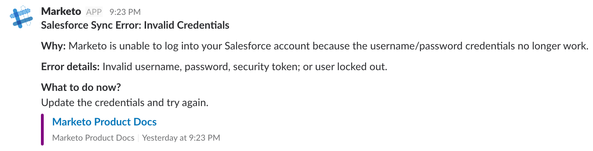

# Aggiungere Slack come servizio LaunchPoint {#add-slack-as-a-launchpoint-service}

Nell’integrazione dello Slack sono inclusi due tipi di notifica:

* **Notifiche** di sistema: Ottieni notifiche di Slack relative a eventi importanti nella tua istanza Marketo, come avvisi sugli stati della campagna corrente e su qualsiasi problema che richieda un’attenzione immediata (errori CRM e limiti API).
* **Momenti** interessanti: Quando Marketo Insight viene attivato da un individuo noto da un account di vendita, i proprietari lead possono essere informati tramite Slack. Le notifiche includono informazioni sui lead e dettagli sull’account di vendita.

>[!NOTE]
>
>**Autorizzazioni amministratore richieste**

>[!PREREQUISITES]
>
>Se non hai già abilitato le notifiche di sistema di Slack, contatta il [Supporto Marketo](https://nation.marketo.com/t5/Support/ct-p/Support).

1. Vai a **LaunchPoint**, quindi in **Nuovo** fai clic su **Nuovo servizio**.

   

1. Immettere un nome visualizzato per l&#39;integrazione dello Slack. Nel menu a discesa **Servizio**, selezionare **Slack**. Fare clic su **Crea**.

   

1. Fare clic su **Autorizza**. Viene aperto uno Slack in una nuova scheda, in cui si completa l’autorizzazione e si concede a Marketo l’autorizzazione per estrarre informazioni dallo Slack.

   

1. Nella nuova scheda Slack, immetti l’URL dell’area di lavoro e fai clic su **Continua**.

   

1. Immetti le credenziali di Slack e fai clic su **Accedi**.

   

1. Nel menu a discesa **Post to** , seleziona il canale in cui vuoi inviare le notifiche da Marketo. Rivedi le autorizzazioni richieste, quindi fai clic su **Autorizza**.

   

1. Dovresti vedere la schermata di conferma qui sotto. La scheda si chiude automaticamente.

   

1. Aggiorna la scheda Marketo e conferma che lo Slack sia ora elencato come servizio attivo in LaunchPoint.

   

   Le notifiche inizieranno a essere inviate al canale selezionato al passaggio 6. Avranno un aspetto simile a questo:

   
