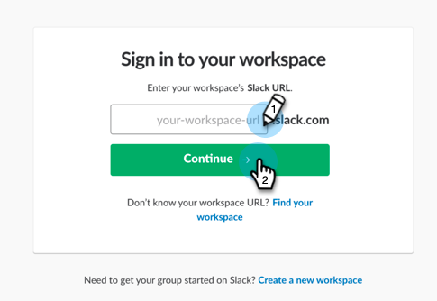
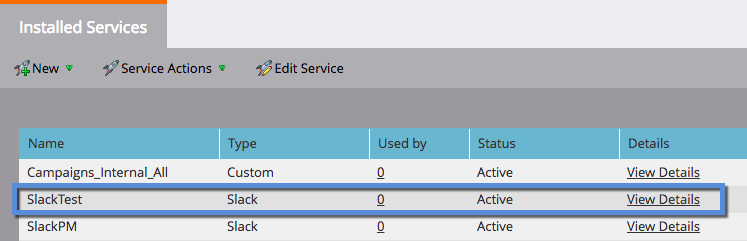

# Aggiungere  Slack come servizio LaunchPoint {#add-slack-as-a-launchpoint-service}

L&#39;integrazione del Slack  include due tipi di notifica:

* **Notifiche** del sistema: Ricevi notifiche  Slack relative a eventi importanti nell&#39;istanza di Marketo, come avvisi sugli stati delle campagne correnti e su eventuali problemi che richiedono un&#39;attenzione immediata (errori CRM e limiti API).
* **Momenti** interessanti: Quando un Marketo Insight è stato attivato da un individuo noto da un conto di vendita, i proprietari principali possono essere informati tramite  Slack. Le notifiche includono informazioni sui lead e dettagli sul conto di vendita.

>[!NOTE]
>
>**Autorizzazioni amministratore richieste**

>[!NOTE]
>
>**Prerequisiti**
>
>Se non avete già attivato  Slack Notifiche di sistema, [contattate il supporto](http://docs.marketo.com/cdn-cgi/l/email-protection#1d6e686d6d726f695d707c6f76786972337e7270).

1. Vai a **LaunchPoint**, quindi in **Nuovo** fai clic su **Nuovo servizio**.

   

1. Immettete un nome da visualizzare per l&#39;integrazione  Slack. Nel menu a discesa **Servizio** , selezionate **Slack**. Fate clic su **Crea**.

   

1. Fate clic su **Autorizza**. Viene aperto  Slack in una nuova scheda, in cui si completa l&#39;autorizzazione e si concede a Marketo l&#39;autorizzazione per estrarre informazioni dal Slack .

   

1. Nella nuova scheda Slack , immettete l’URL dell’area di lavoro e fate clic su **Continua**.

   

1. Immettete le credenziali  Slack e fate clic su **Accedi**.

   

1. Nel menu a discesa **Post to** (Post to Post to Post), selezionate il canale in cui desiderate inviare le notifiche da Marketo. Rivedete le autorizzazioni richieste, quindi fate clic su **Autorizza**.

   

1. Di seguito viene visualizzata la schermata di conferma. La scheda si chiude automaticamente.

   

1. Aggiorna la scheda Marketo e conferma che  Slack è ora elencato come servizio attivo in LaunchPoint.

   

   Le notifiche iniziano a essere inviate al canale selezionato al punto 6. Avranno un aspetto simile a questo:

   

