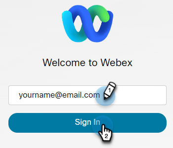

# Aggiungere Webex come servizio LaunchPoint {#add-webex-as-a-launchpoint-service}

Il Marketo Engage gestisce la registrazione e la partecipazione del webinar Webex.

>[!NOTE]
>
>**Autorizzazioni amministratore richieste**

>[!NOTE]
>
>Per questo passaggio è necessaria una sottoscrizione esistente a Webex e diritti di amministrazione. Disporre delle seguenti impostazioni: Nome utente, password e nome del sito.

>[!NOTE]
>
>Il nome del sito si trova alla fine dell’URL utilizzato per accedere a Webex. Ad esempio:
>
>`https://mycompany.webex.com/mw0300lc/mywebex/default.do?siteurl=mycompany`
>
>**Attenzione:** Non inserire l’intero URL in questo campo; immetti solo il nome del sito!

1. Vai a **Amministratore** area.

   

1. Fai clic su **LaunchPoint**.

   

1. Seleziona **Nuovo** e poi **Nuovo servizio**.

   

1. Inserisci un **Nome visualizzato**. Sotto **Servizio**, seleziona **Webex**.

   

1. Inserisci il tuo **Nome utente** e **Password**.

   

1. Completa il processo inserendo il **Nome del sito** quindi fai clic su **Crea**.

   

1. Fenomenale! Le **Webex** ora è sincronizzato con Marketo.

   

>[!MORELIKETHIS]
>
>Scopri come [creare un evento con Webex](/help/marketo/product-docs/demand-generation/events/create-an-event/create-an-event-with-webex.md){target=&quot;_blank&quot;}.
