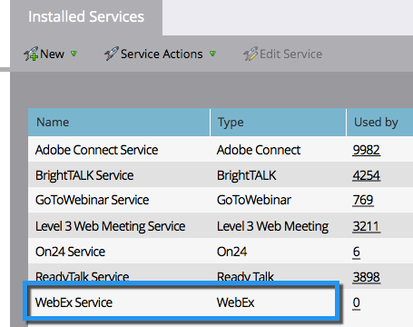

# Aggiungi [!DNL Webex] come servizio [!DNL LaunchPoint] {#add-webex-as-a-launchpoint-service}

Marketo Engage gestisce la registrazione e la partecipazione al webinar [!DNL Webex]. È necessario disporre di una sottoscrizione esistente a [[!UICONTROL Webex]](https://www.webex.com/).

>[!NOTE]
>
>**Autorizzazioni amministratore richieste**

1. Passa alla schermata **[!UICONTROL Admin]**.

   

1. Fai clic su **[!UICONTROL LaunchPoint]**.

   

1. Selezionare **[!UICONTROL New]** e quindi **[!UICONTROL New Service]**.

   

1. Immetti **[!UICONTROL Display Name]**. Nel menu a discesa **[!UICONTROL Service]**, selezionare **[!UICONTROL Webex Webinars]**.

   

1. Fai clic su **[!UICONTROL Log Into Webex Webinars]**.

   

1. Webex si apre in una nuova scheda. Accedi utilizzando le credenziali Webex.

   

1. Dopo aver effettuato l&#39;accesso, la scheda si chiude e la finestra modale _New Service_ in Marketo Engage riporta &quot;Webex Webinars account is set&quot; (L&#39;account Webex Webinars è impostato). Fai clic su **[!UICONTROL Create]**.

   

**[!DNL Webex]** è ora sincronizzato con Marketo.

>[!MORELIKETHIS]
>
>[Crea un evento con [!DNL Webex]](/help/marketo/product-docs/demand-generation/events/create-an-event/create-an-event-with-webex.md){target="_blank"}.
