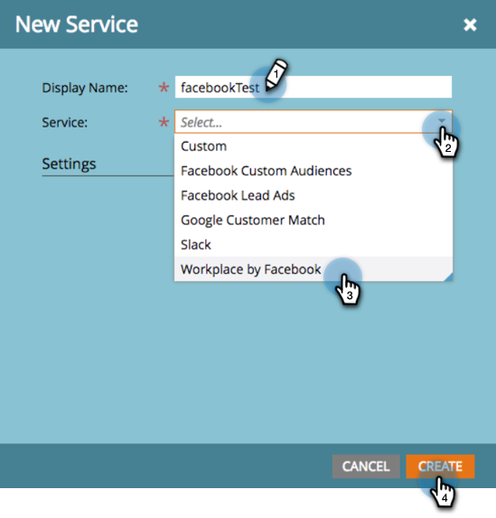
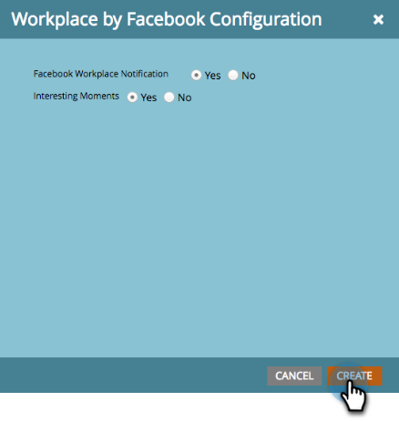

# Aggiungi Workplace da Facebook as a LaunchPoint Service {#add-workplace-by-facebook-as-a-launchpoint-service}

Nell’integrazione di Workspace sono inclusi due tipi di notifica:

* **Notifiche** di sistema: Ottieni notifiche Workspace relative a eventi importanti nella tua istanza di Marketo, come avvisi sugli stati della campagna corrente e su qualsiasi problema che richieda un’attenzione immediata (errori CRM e limiti API).
* **Momenti** interessanti: Quando Marketo Insight è stato attivato da un individuo noto da un account di vendita, i proprietari dei lead possono essere avvisati tramite Workplace. Le notifiche includono informazioni sui lead e dettagli sull’account di vendita.

>[!NOTE]
>
>**Autorizzazioni amministratore richieste**

>[!PREREQUISITES]
>
>Se non hai già abilitato le notifiche di Workspace, contatta il [Supporto Marketo](https://nation.marketo.com/t5/Support/ct-p/Support).

1. Vai a **LaunchPoint**, quindi in **Nuovo** fai clic su **Nuovo servizio**.

   

1. Immetti un nome visualizzato per l’integrazione di Workspace. Nel menu a discesa **Servizio**, seleziona **Area di lavoro per Facebook**. Fare clic su **Crea**.

   

1. Per ricevere notifiche di sistema e momenti interessanti, lascia le opzioni così come sono. Fare clic su **Crea**.

   

1. Fare clic su **Autorizza**. Viene aperto Workspace in una nuova scheda, in cui verrà completata l’autorizzazione e verrà concessa l’autorizzazione Marketo per estrarre informazioni da Workspace.

   

1. Nella nuova scheda Area di lavoro, immetti il nome utente e-mail aziendale o Area di lavoro e fai clic su **Continua**.

   

1. Immetti le credenziali di Workspace e fai clic su **Accedi**.

   

1. Nella finestra a comparsa Area di lavoro, scegli un gruppo Facebook in cui desideri inviare le notifiche da Marketo (ad esempio, Integrazioni partner). Fare clic su **Installa**.

   

1. Di seguito è riportata la notifica di conferma. La scheda si chiude automaticamente.

   

1. Aggiorna la scheda Marketo e conferma che Workplace sia ora elencato come servizio attivo in LaunchPoint.

   

   Le notifiche inizieranno a essere pubblicate sul gruppo Facebook selezionato al passaggio 7. Avranno un aspetto simile a questo:

   
