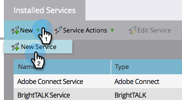
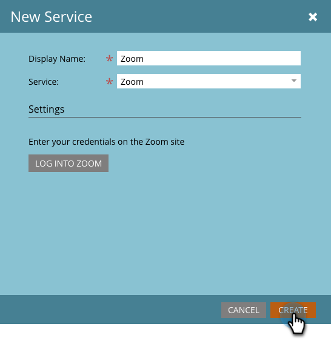

# Aggiungi [!DNL Zoom] as a [!DNL LaunchPoint] Servizio {#add-zoom-as-a-launchpoint-service}

Marketo gestisce [!DNL Zoom] registrazione e partecipazione.

>[!NOTE]
>
>**Autorizzazioni amministratore richieste**

>[!NOTE]
>
>Un abbonamento esistente a [!DNL Zoom] e i diritti di amministrazione sono necessari per questa fase. Avere l&#39;indirizzo e-mail e la password utilizzati per accedere a [!DNL Zoom] disponibile.

1. Vai a **[!UICONTROL Amministratore]** area.

   

1. Clic **[!UICONTROL LaunchPoint]**.

   

1. Seleziona **[!UICONTROL Nuovo]** e poi **[!UICONTROL Nuovo servizio]**.

   

1. Immetti un **[!UICONTROL Nome visualizzato]**. Sotto **[!UICONTROL Servizio]**, seleziona **[!UICONTROL Zoom]**.

   

1. Clic **[!UICONTROL Accedi a Zoom]**.

   

1. In [!DNL Zoom] finestra di accesso, immettere [!DNL Zoom] e fai clic su **[!UICONTROL Accedi]**.

   

1. Dopo aver chiuso la finestra, fai clic su **[!UICONTROL Crea]**.

   

Il tuo [!DNL Zoom] l&#39;account è ora sincronizzato con Marketo e si trova nel [!UICONTROL LaunchPoint] area.

>[!CAUTION]
>
>Quando si aggiorna la password in Zoom, è necessario aggiornare la password anche in Marketo.

>[!MORELIKETHIS]
>
>Scopri come [creare un evento con [!DNL Zoom]](/help/marketo/product-docs/demand-generation/events/create-an-event/create-an-event-with-zoom.md).
