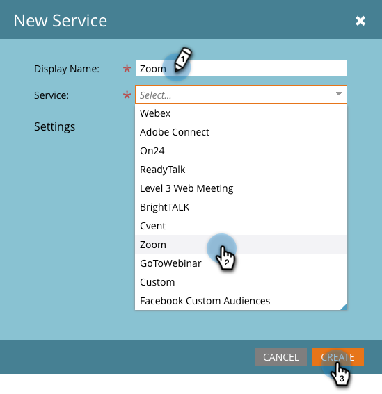

# Aggiungere Zoom come servizio LaunchPoint {#add-zoom-as-a-launchpoint-service}

Marketo gestisce la registrazione e la partecipazione dello zoom.

>[!NOTE]
>
>**Autorizzazioni amministratore richieste**

>[!NOTE]
>
>Per questo passaggio è necessaria una sottoscrizione esistente ai diritti di zoom e amministrazione. Usa le e-mail e la password per accedere a Zoom a portata di mano.

1. Vai all&#39;area **Amministratore** e fai clic su **LaunchPoint**.

   

1. Fai clic sul menu a discesa **Nuovo** e seleziona **Nuovo servizio**.

   

1. Immettere un **nome visualizzato**. In **Servizio**, selezionare **Zoom**.

   

1. Fare clic su **Accedi a Zoom**.

   

1. Nella finestra di accesso Zoom, immetti le credenziali di zoom e fai clic su **Accedi**.

   

1. Una volta chiusa la finestra, fai clic su **Crea**.

   

   Fantastico! L’account Zoom è ora sincronizzato con Marketo e si trova nell’area LaunchPoint.

>[!CAUTION]
>
>Quando si aggiorna la password in Zoom, è necessario aggiornare la password anche in Marketo.

>[!MORELIKETHIS]
>
>Scopri come [creare un evento con Zoom](/help/marketo/product-docs/demand-generation/events/create-an-event/create-an-event-with-zoom.md).
