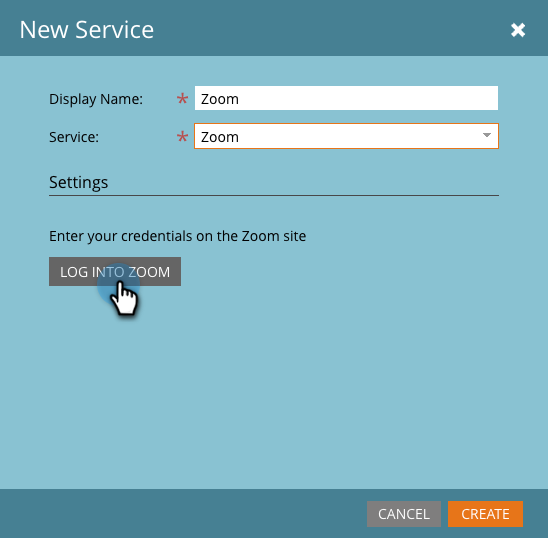

# Aggiungi [!DNL Zoom] come servizio [!DNL LaunchPoint] {#add-zoom-as-a-launchpoint-service}

Marketo gestisce la registrazione e la partecipazione a [!DNL Zoom].

>[!NOTE]
>
>**Autorizzazioni amministratore richieste**

>[!NOTE]
>
>Per questo passaggio sono necessari un abbonamento esistente a [!DNL Zoom] e diritti di amministrazione. Disponi dell&#39;e-mail e della password utilizzate per accedere a [!DNL Zoom].

1. Vai all&#39;area **[!UICONTROL Amministratore]**.

   

1. Fare clic su **[!UICONTROL LaunchPoint]**.

   

1. Selezionare **[!UICONTROL Nuovo]** e quindi **[!UICONTROL Nuovo servizio]**.

   

1. Immetti un **[!UICONTROL Nome visualizzato]**. In **[!UICONTROL Servizio]**, selezionare **[!UICONTROL Zoom]**.

   

1. Fare clic su **[!UICONTROL Accedi a Zoom]**.

   

1. Nella finestra di accesso di [!DNL Zoom], immetti le tue credenziali di [!DNL Zoom] e fai clic su **[!UICONTROL Accedi]**.

   

1. Dopo la chiusura della finestra, fare clic su **[!UICONTROL Crea]**.

   

L&#39;account [!DNL Zoom] è ora sincronizzato con Marketo e si trova nell&#39;area [!UICONTROL LaunchPoint].

>[!CAUTION]
>
>Quando si aggiorna la password in Zoom, è necessario aggiornare la password anche in Marketo.

>[!MORELIKETHIS]
>
>Scopri come [creare un evento con [!DNL Zoom]](/help/marketo/product-docs/demand-generation/events/create-an-event/create-an-event-with-zoom.md).
