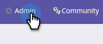

# Collegare BrightTALK a Marketo {#connect-brighttalk-to-marketo}

Scopri come collegare il tuo canale BrightTALK alla tua istanza Marketo. Per farlo, devi essere un amministratore per entrambi.

>[!NOTE]
>
>**Autorizzazioni amministratore richieste**

## Passaggi in BrightTALK {#steps-in-brighttalk}

1. Accedi a [business.brighttalk.com/demandcentral](https://business.brighttalk.com/demandcentral/login) e fai clic su **Connetti ora**.
1. In Connettore Marketo avanzato, fai clic su **Connetti**.
1. Verrà visualizzata la schermata delle credenziali, chiedendo: ID client, segreto client, URL del servizio Identity e URL del servizio di ripristino. Per ottenere queste informazioni, accedi a Marketo.

## Passaggi in Marketo {#steps-in-marketo}

>[!NOTE]
>
>A questo punto ti verrà richiesto di impostare un ruolo utente solo API e un utente API per limitare quali autorizzazioni avranno BrightTALK nella tua istanza Marketo. Poiché abbiamo già articoli per questi passaggi, vi collegheremo a loro.

1. Crea un [Ruolo utente solo API](/help/marketo/product-docs/administration/users-and-roles/create-an-api-only-user-role.md).
1. [Crea un utente](/help/marketo/product-docs/administration/users-and-roles/create-an-api-only-user.md) API utilizzando il ruolo API BrightTALK creato durante il passaggio 4.
1. Torna all’area Amministratore.

   

1. In Integrazione, fai clic su **LaunchPoint**.

   

1. Fai clic sul menu a discesa **Nuovo** e seleziona **Nuovo servizio**.

   

1. Immetti un Nome visualizzato a tua scelta. Fai clic sul menu a discesa Servizio e seleziona **Personalizzato** (fai _non_ seleziona BrightTALK).

   

   >[!CAUTION]
   >
   >Ricordare di non selezionare BrightTALK nel menu a discesa. Si tratta di un campo che stiamo tentando di rimuovere e la sua selezione potrebbe creare problemi significativi con l’integrazione Marketo/BrightTALK.

1. Inserisci una descrizione a tua scelta. Fai clic sull’elenco a discesa Solo utente API e seleziona l’utente API BrightTALK creato durante il passaggio 5. Fare clic su **Crea**.

   

1. Fai clic su **Visualizza dettagli** per il servizio personalizzato appena creato.

   

1. Copia (e salva) il **ID client** e il **Segreto client**. Fare clic su **Chiudi**.

   

1. In Integrazione, selezionare **Servizi Web**.

   

1. In Rest API, copia (e salva) l’ **Endpoint** e **Identità**.

   

## Ulteriori passaggi in BrightTALK {#additional-steps-in-brighttalk}

1. Torna alla schermata di configurazione del connettore BrightTALK dal passaggio 3 e immetti le credenziali salvate dai passaggi 12 e 14.

   Dopo l&#39;autenticazione delle credenziali, hai collegato ufficialmente BrightTALK a Marketo. Il passaggio successivo consiste nel determinare [quali campi dati si desidera sincronizzare](https://support.brighttalk.com/hc/en-us/articles/115005131274-BrightTALK-Connector-for-Marketo-Choose-the-Fields-to-Sync).
