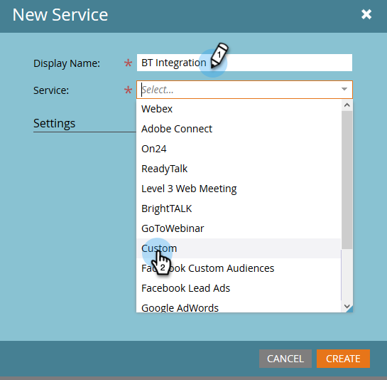

# Connetti [!DNL BrightTALK] a Marketo {#connect-brighttalk-to-marketo}

Scopri come collegare il canale [!DNL BrightTALK] all&#39;istanza Marketo. A questo scopo, devi essere un amministratore per entrambi.

>[!NOTE]
>
>**Autorizzazioni amministratore richieste**

## Passaggi in [!DNL BrightTALK] {#steps-in-brighttalk}

1. Accedi a [business.brighttalk.com/demandcentral](https://business.brighttalk.com/demandcentral/login){target="_blank"} e fai clic su **[!UICONTROL Connetti ora]**.
1. In [!UICONTROL Connettore Marketo avanzato], fare clic su **[!UICONTROL Connetti]**.
1. Viene visualizzata la schermata delle credenziali in cui vengono richiesti: ID client, Segreto client, URL del servizio identità e URL del servizio rest. Per ottenere queste informazioni, accedi a Marketo.

## Passaggi in Marketo {#steps-in-marketo}

>[!NOTE]
>
>A questo punto ti verrà richiesto di impostare [!DNL API Only User Role] e [!DNL API User] per limitare le autorizzazioni di [!DNL BrightTALK] nell&#39;istanza di Marketo. Poiché disponiamo già di articoli per questi passaggi, ti collegheremo a essi.

1. Crea un ruolo utente [solo API](/help/marketo/product-docs/administration/users-and-roles/create-an-api-only-user-role.md){target="_blank"}.

1. [Crea un utente API](/help/marketo/product-docs/administration/users-and-roles/create-an-api-only-user.md){target="_blank"}, utilizzando il ruolo API [!DNL BrightTALK] creato durante il passaggio 4.

1. Torna all&#39;area **[!UICONTROL Amministratore]**.

   

1. In **[!UICONTROL Integrazione]**, fare clic su **[!UICONTROL LaunchPoint]**.

   

1. Fai clic sul menu a discesa **[!UICONTROL Nuovo]** e seleziona **[!UICONTROL Nuovo servizio]**.

   

1. Immetti un **[!UICONTROL Nome visualizzato]** a tua scelta. Fai clic sul menu a discesa **[!UICONTROL Servizio]** e seleziona **[!UICONTROL Personalizzato]** (fai _non_ seleziona [!DNL BrightTALK]).

   

   >[!CAUTION]
   >
   >Ricordarsi di non selezionare [!DNL BrightTALK] nel menu a discesa. È un campo che stiamo rimuovendo e la sua selezione potrebbe creare problemi significativi con l&#39;integrazione di [!DNL Marketo/BrightTALK].

1. Immetti una [!UICONTROL Descrizione] a tua scelta. Fai clic sul menu a discesa **[!UICONTROL Utente solo API]** e seleziona [!DNL BrightTALK API User] creato durante il passaggio 5. Fai clic su **[!UICONTROL Crea]**.

   

1. Fai clic su **[!UICONTROL Visualizza dettagli]** per il servizio personalizzato appena creato.

   

1. Copia (e salva) **[!UICONTROL ID client]** e **[!UICONTROL Segreto client]**. Fai clic su **[!UICONTROL Chiudi]**.

   

1. In **[!UICONTROL Integrazione]**, selezionare **[!UICONTROL Servizi Web]**.

   

1. In **[!UICONTROL API REST]**, copia (e salva) l&#39;**[!UICONTROL endpoint]** e la **[!UICONTROL identità]**.

   

## Passaggi aggiuntivi in [!DNL BrightTALK] {#additional-steps-in-brighttalk}

1. Tornare alla schermata di configurazione del connettore [!DNL BrightTALK] dal passaggio 3 e immettere le credenziali salvate dai passaggi 12 e 14.

Dopo l&#39;autenticazione delle credenziali, [!DNL BrightTALK] è stato ufficialmente connesso a Marketo. Il passaggio successivo consiste nel determinare [i campi dati da sincronizzare](https://support.brighttalk.com/hc/en-us/articles/115005131274-BrightTALK-Connector-for-Marketo-Choose-the-Fields-to-Sync){target="_blank"}.
