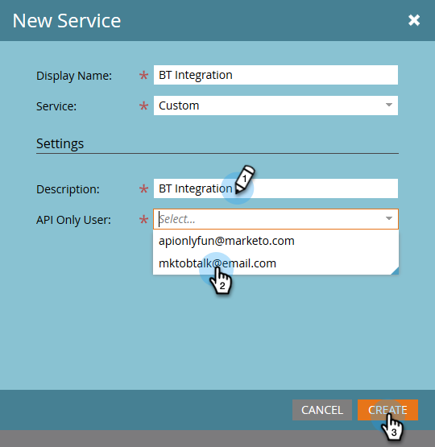

# Connetti [!DNL BrightTALK] a MARKETO {#connect-brighttalk-to-marketo}

Scopri come collegare il tuo [!DNL BrightTALK] alla tua istanza Marketo. A questo scopo, devi essere un amministratore per entrambi.

>[!NOTE]
>
>**Autorizzazioni amministratore richieste**

## Passaggi [!DNL BrightTALK] {#steps-in-brighttalk}

1. Accedi a [business.brighttalk.com/demandcentral](https://business.brighttalk.com/demandcentral/login){target="_blank"} e fai clic su **[!UICONTROL Connetti]**.
1. Sotto [!UICONTROL Connettore Marketo avanzato], fai clic su **[!UICONTROL Connetti]**.
1. Viene visualizzata la schermata delle credenziali in cui vengono richiesti: ID client, Segreto client, URL del servizio identità e URL del servizio rest. Per ottenere queste informazioni, accedi a Marketo.

## Passaggi in Marketo {#steps-in-marketo}

>[!NOTE]
>
>A questo punto ti verrà richiesto di impostare un [!DNL API Only User Role] e [!DNL API User] per limitare le autorizzazioni [!DNL BrightTALK] avrà nell’istanza di Marketo. Poiché disponiamo già di articoli per questi passaggi, ti collegheremo a essi.

1. Creare un [Solo ruolo utente API](/help/marketo/product-docs/administration/users-and-roles/create-an-api-only-user-role.md){target="_blank"}.

1. [Creare un utente API](/help/marketo/product-docs/administration/users-and-roles/create-an-api-only-user.md){target="_blank"}, utilizzando [!DNL BrightTALK] Ruolo API creato durante il passaggio 4.

1. Torna a **[!UICONTROL Amministratore]** area.

   

1. Sotto **[!UICONTROL Integrazione]**, fai clic su **[!UICONTROL LaunchPoint]**.

   

1. Fai clic su **[!UICONTROL Nuovo]** a discesa e selezionare **[!UICONTROL Nuovo servizio]**.

   

1. Immetti un **[!UICONTROL Nome visualizzato]** di tua scelta. Fai clic su **[!UICONTROL Servizio]** a discesa e selezionare **[!UICONTROL Personalizzato]** (fare _non_ seleziona [!DNL BrightTALK]).

   

   >[!CAUTION]
   >
   >Ricordati di non selezionare [!DNL BrightTALK] nel menu a discesa. Si tratta di un campo che stiamo rimuovendo e la sua selezione potrebbe creare problemi significativi con il tuo [!DNL Marketo/BrightTALK] integrazione.

1. Immetti un [!UICONTROL Descrizione] di tua scelta. Fai clic su **[!UICONTROL Utente solo API]** e selezionare il [!DNL BrightTALK API User] creato durante il passaggio 5. Fai clic su **[!UICONTROL Crea]**.

   

1. Clic **[!UICONTROL Visualizza dettagli]** per il servizio personalizzato appena creato.

   

1. Copia (e salva) il **[!UICONTROL ID client]** e **[!UICONTROL Segreto client]**. Fai clic su **[!UICONTROL Chiudi]**.

   

1. Sotto **[!UICONTROL Integrazione]**, seleziona **[!UICONTROL Servizi Web]**.

   

1. Sotto **[!UICONTROL API REST]**, copia (e salva) il **[!UICONTROL Endpoint]** e **[!UICONTROL Identità]**.

   

## Passaggi aggiuntivi in [!DNL BrightTALK] {#additional-steps-in-brighttalk}

1. Torna a [!DNL BrightTALK] schermata di configurazione del connettore dal passaggio 3 e immettere le credenziali salvate dai passaggi 12 e 14.

Dopo l&#39;autenticazione delle credenziali, è stata stabilita la connessione ufficiale [!DNL BrightTALK] a Marketo. Il passaggio successivo consiste nel determinare [quali campi dati si desidera sincronizzare](https://support.brighttalk.com/hc/en-us/articles/115005131274-BrightTALK-Connector-for-Marketo-Choose-the-Fields-to-Sync){target="_blank"}.
