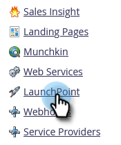

# Creare un servizio personalizzato da utilizzare con API ReST {#create-a-custom-service-for-use-with-rest-api}

Se desideri effettuare l’integrazione con Marketo tramite l’API ReST, crea un servizio personalizzato.

>[!PREREQUISITES]
>
>* [Crea un ruolo utente solo API](/help/marketo/product-docs/administration/users-and-roles/create-an-api-only-user-role.md)
>* [Crea un utente solo API](/help/marketo/product-docs/administration/users-and-roles/create-api-only-user.md)
>

>[!NOTE]
>
>**Autorizzazioni amministratore richieste**

>[!TIP]
>
>Per informazioni dettagliate sull&#39;[API REST](https://developer.adobe.com/marketo-apis/), consulta la documentazione per gli sviluppatori.

## Crea servizio personalizzato {#create-custom-service}

1. Passa alla schermata **[!UICONTROL Admin]**.

   

1. Fai clic su **[!UICONTROL LaunchPoint]**.

   

1. Selezionare **[!UICONTROL New]** e quindi **[!UICONTROL New Service]**.

   

1. Immettere **[!UICONTROL Display Name]** per il servizio. Seleziona **[!UICONTROL API Only User]** [creato in precedenza](/help/marketo/product-docs/administration/users-and-roles/create-api-only-user.md).

   

1. Fai clic su **[!UICONTROL Create]**.

   

   Il servizio è stato creato. Recupera le credenziali da fornire per l’accesso.

## Credenziali per l’accesso API {#credentials-for-api-access}

1. Passa alla schermata **[!UICONTROL Admin]**.

   

1. Fai clic su **[!UICONTROL LaunchPoint]**.

   

1. Fare clic su **[!UICONTROL View Details]** per il servizio [!UICONTROL LaunchPoint] personalizzato creato in precedenza.

   

1. Fai clic su **[!UICONTROL Get Token]**.

   

1. Fornisci **[!UICONTROL Client Id]**, **[!UICONTROL Client Secret]**, **[!UICONTROL Authorized User]** e **[!UICONTROL Token]** alla persona responsabile di stabilire la connessione.

   

>[!CAUTION]
>
>Non condividere queste informazioni, poiché consentono di accedere ai dati.
