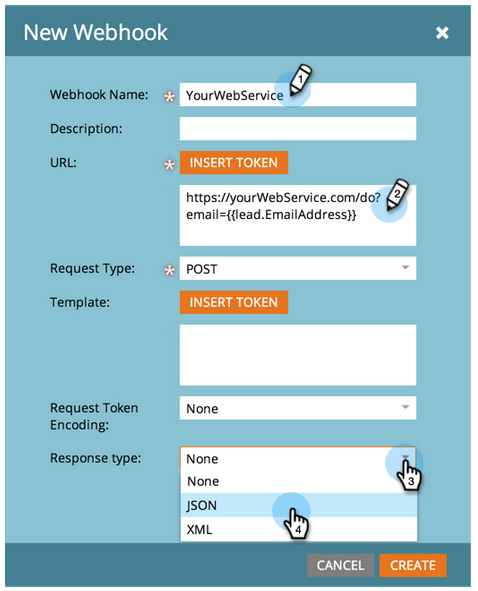

# Creare un [!DNL Webhook] {#create-a-webhook}

Utilizzare [!DNL Webhooks] per sfruttare i servizi web di terze parti per inviare messaggi di testo, espandere i dati di persone e altro ancora.

>[!AVAILABILITY]
>
>Non tutti gli utenti del Marketo Engage hanno acquistato questa funzionalità. Per ulteriori informazioni, contatta l’Adobe Account Team (il tuo Account Manager).

1. Vai a **[!UICONTROL Amministratore]** area.

   

1. Clic **[!UICONTROL Webhook]**.

   

1. Clic **[!UICONTROL Nuovo webhook]**.

   

1. Denomina e configura il tuo [!DNL Webhook].

   

   >[!NOTE]
   >
   >Questo spesso include l’immissione delle credenziali del servizio di terze parti come parametro URL o nel modello POST.

   * **[!UICONTROL URL]**: immetti l’URL da utilizzare nella richiesta al servizio web. Per inserire un token, ad esempio l’indirizzo e-mail della persona (**`{{lead.Email Address}}`**), nella tua richiesta, fai clic su **[!UICONTROL Inserisci token]**.

   * **[!UICONTROL Modello]**: se desideri trasmettere le informazioni nel corpo della richiesta, immetti tramite il modello di payload. Modelli consentiti per i seguenti tipi di richiesta: POST, DELETE, PATCH o PUT. Puoi utilizzare formati di dati come JSON o XML. Per inserire un token nel modello, fai clic su **[!UICONTROL Inserisci token]**.

   * **[!UICONTROL Richiedi codifica token]**: se i valori del token includono caratteri speciali (ad esempio una e commerciale, &#39;&amp;&#39;), indica il formato della richiesta (**JSON** o **Modulo/Url**).

   * **[!UICONTROL Tipo di risposta]**: seleziona il formato della risposta ricevuta dal servizio (**JSON** o **XML**).

   * **[!UICONTROL Tipo di richiesta]**: seleziona il metodo HTTP da utilizzare (DELETE, GET, PATCH, POST, PUT).

1. Clic **[!UICONTROL Crea]**.

   

>[!NOTE]
>
>Per ulteriori informazioni, consulta [[!DNL Webhooks]](https://experienceleague.adobe.com/en/docs/marketo-developer/marketo/webhooks/webhooks){target="_blank"} immersione profonda.
