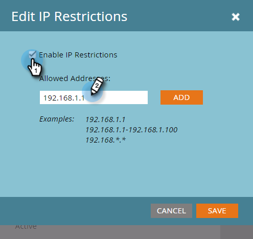

# Creare un Inserisco nell&#39;elenco Consentiti di accesso API basato su IP {#create-an-allowlist-for-ip-based-api-access}

A volte, è necessario concedere l’accesso API solo a un indirizzo IP specifico o a un intervallo di indirizzi. A questo scopo, devi innanzitutto abilitare le restrizioni, quindi specificare gli indirizzi IP che possono utilizzare le API.

>[!NOTE]
>
>**Autorizzazioni amministratore richieste**

>[!NOTE]
>
>Questa funzione opera indipendentemente dalle restrizioni di accesso basate su IP di Marketo Engage (venendo sostituita dall&#39;elenco di accesso IP di Admin Console*) e continuerà a funzionare dopo la [migrazione Adobe IMS](/help/marketo/product-docs/administration/marketo-with-adobe-identity/adobe-identity-management-overview.md).
>> 
>>&#42;La disponibilità generale dell’elenco di accesso IP è prevista per il quarto trimestre del 2025.

1. Passare all&#39;area **[!UICONTROL Admin]**.

   

1. Fai clic su **[!UICONTROL Web Services]**.

   

1. Nell&#39;area **[!UICONTROL IP Restrictions]** fare clic su **[!UICONTROL Edit],** o su **[!UICONTROL Edit IP Restrictions]** in alto a sinistra.

   

1. Inserire nell&#39;elenco Consentiti Selezionare la casella **[!UICONTROL Enable IP Restrictions]** e immettere gli indirizzi IP che si desidera.

   

   >[!NOTE]
   >
   >È possibile immettere un singolo indirizzo IP o un intervallo oppure utilizzare un carattere jolly.

1. Fare clic su **[!UICONTROL Add]** per aprire ulteriori campi e immettere altri indirizzi IP.

   

1. Fai clic su **[!UICONTROL Save]**.

   
