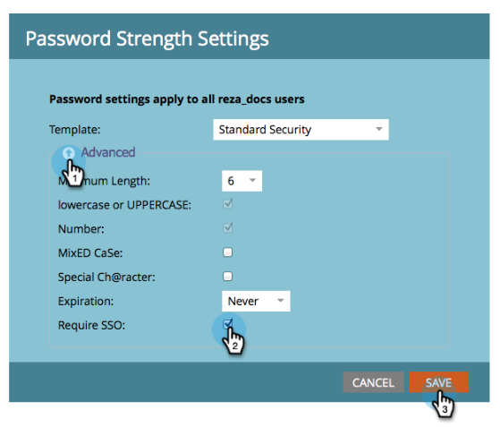

# Limita l&#39;accesso degli utenti solo all&#39;SSO {#restrict-user-login-to-sso-only}

Se sei [utilizzo di SSO](/help/marketo/product-docs/administration/additional-integrations/add-single-sign-on-to-a-portal.md) e desideri garantire che gli utenti non possano ignorare la sicurezza SSO, segui queste istruzioni.

>[!IMPORTANT]
>
>Il presente articolo non si applica a [Adobe IMS abilitato](/help/marketo/product-docs/administration/marketo-with-adobe-identity/adobe-identity-management-overview.md) abbonamenti Marketo.

>[!NOTE]
>
>**Autorizzazioni amministratore richieste**

1. Vai a **[!UICONTROL Amministratore]** area.

   

1. Clic **[!UICONTROL Impostazione di accesso]s**.

   

1. Clic **[!UICONTROL Modifica impostazioni di protezione]**.

   

1. Espandi **[!UICONTROL Avanzate]** impostazioni, verifica **[!UICONTROL Richiedi SSO]** e fai clic su **[!UICONTROL Salva]**.

>[!NOTE]
>
>Si consiglia di invitare e accettare l’invito gli utenti. _Dopo_ l’invito è accettato, gli amministratori devono quindi impostarlo su &quot;[!UICONTROL Richiedi SSO].&quot;

>[!TIP]
>
>Se si seleziona **[!UICONTROL Richiedi SSO]**, è possibile escludere un [ruolo utente](/help/marketo/product-docs/administration/users-and-roles/create-delete-edit-and-change-a-user-role.md) da questa restrizione controllando il **[!UICONTROL Ignora Single Sign-On]** durante la configurazione del ruolo. In questo modo gli utenti potranno accedere normalmente. Ad esempio, gli utenti Admin potrebbero dover ancora accedere a Marketo tramite la schermata di accesso.

>[!CAUTION]
>
>Quando nuovi utenti vengono invitati, ricevono le e-mail di invito. Tuttavia, se **[!UICONTROL Richiedi SSO]** , a meno che non siano assegnati a un ruolo impostato su **[!UICONTROL Ignora Single Sign-On]**.

Tutto qui! Ora tutti gli utenti (ad eccezione di quelli che dispongono dell&#39;autorizzazione per ignorare il Single Sign-On) saranno limitati a utilizzare solo l&#39;accesso SSO.

>[!MORELIKETHIS]
>
>* [Aggiungere il Single Sign-On a un portale](/help/marketo/product-docs/administration/additional-integrations/add-single-sign-on-to-a-portal.md)
>* [Utilizzo di un ID universale per l’accesso in abbonamento](/help/marketo/product-docs/administration/settings/using-a-universal-id-for-subscription-login.md)
>* [Invito degli utenti di Marketo a due istanze con ID universale](https://nation.marketo.com/t5/Knowledgebase/Inviting-Marketo-Users-to-Two-Instances-with-Universal-ID-UID/ta-p/251122)
