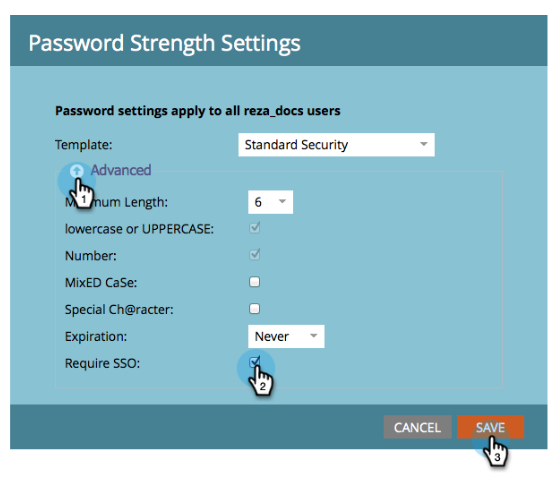

# Limitare l’accesso utente solo al SSO {#restrict-user-login-to-sso-only}

Se [utilizzi SSO](/help/marketo/product-docs/administration/additional-integrations/add-single-sign-on-to-a-portal.md) e vuoi essere certo che gli utenti non possano ignorare la sicurezza SSO, segui queste istruzioni.

>[!IMPORTANT]
>
>Questo articolo non è applicabile alle [sottoscrizioni Marketo abilitate per Adobe IMS](/help/marketo/product-docs/administration/marketo-with-adobe-identity/adobe-identity-management-overview.md).

>[!NOTE]
>
>**Autorizzazioni amministratore richieste**

1. Passa alla schermata **[!UICONTROL Admin]**.

   

1. Fai clic su **[!UICONTROL Login Settings]**.

   

1. Fai clic su **[!UICONTROL Edit Security Settings]**.

   

1. Espandere le impostazioni di **[!UICONTROL Advanced]**, selezionare **[!UICONTROL Require SSO]** e fare clic su **[!UICONTROL Save]**.

>[!NOTE]
>
>Si consiglia di invitare e accettare l’invito gli utenti. _Dopo_ l&#39;invito è accettato, gli amministratori devono quindi impostarli su &quot;[!UICONTROL Require SSO]&quot;.

>[!TIP]
>
>Se si seleziona **[!UICONTROL Require SSO]**, è possibile escludere un [ruolo utente](/help/marketo/product-docs/administration/users-and-roles/create-delete-edit-and-change-a-user-role.md) da questa restrizione selezionando l&#39;opzione **[!UICONTROL Bypass Single Sign-On]** durante la configurazione del ruolo. Questo consente agli utenti di accedere normalmente. Ad esempio, gli utenti Admin potrebbero dover ancora accedere a Marketo tramite la schermata di accesso. Se sono abilitati sia SSO che Universal ID, è necessario disporre dell&#39;autorizzazione &quot;Bypass Single Signed On&quot; (Ignora Single Sign On) per attivare o disattivare le sottoscrizioni.

>[!CAUTION]
>
>Quando nuovi utenti vengono invitati, ricevono le e-mail di invito. Tuttavia, se è selezionato **[!UICONTROL Require SSO]**, questi messaggi non vengono ricevuti a meno che non siano assegnati a un ruolo impostato su **[!UICONTROL Bypass Single Sign-On]**.

Ora tutti gli utenti (ad eccezione di quelli che dispongono dell&#39;autorizzazione per ignorare il Single Sign-On) possono utilizzare solo l&#39;accesso SSO.

>[!MORELIKETHIS]
>
>* [Aggiungi Single Sign-On a un portale](/help/marketo/product-docs/administration/additional-integrations/add-single-sign-on-to-a-portal.md)
>* [Invito di utenti Marketo a due istanze con ID universale](https://nation.marketo.com/t5/Knowledgebase/Inviting-Marketo-Users-to-Two-Instances-with-Universal-ID-UID/ta-p/251122)
