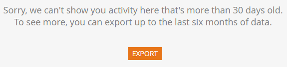

# Panoramica della traccia di audit {#audit-trail-overview}

Audit Trail consente di ottenere una cronologia completa (per un periodo di sei mesi) delle modifiche apportate all’interno dell’istanza Marketo.

>[!NOTE]
>
>La cronologia dei dati di audit trail è iniziata il 14 settembre 2016.

## Che cos’è Audit Trail {#what-is-audit-trail}

Audit Trail acquisisce in tempo reale un elenco completo delle azioni e degli eventi che si verificano all’interno di una sottoscrizione Marketo. Include un modo self-service per accedere a una cronologia di dati di sei mesi per rispondere a domande come:

Cos’è successo a questa risorsa o impostazione e chi l’ha aggiornata per ultimo?

Fino a che punto è stato l&#39;utente X?

Chi effettua l&#39;accesso al nostro account?

## Controllo {#what-we-audit}

Marketo controllerà [creare, modificare ed eliminare](/help/marketo/product-docs/administration/audit-trail/change-details-in-audit-trail.md) azioni per:

* Progettazione di risorse in studio
* Tutti i programmi Marketo
* Campagne intelligenti
* Elenchi (smart/statici)
* Utenti (amministratore)
* Ruoli e autorizzazioni (amministratore)
* Area di lavoro e partizioni (amministratore)
* Cronologia degli accessi utente

>[!NOTE]
>
>Marketo è _not_ al momento è possibile controllare le modifiche apportate in Personalizzazione web, Contenuto predittivo o Approfondimenti vendite.

## Componenti della traccia di audit {#audit-trail-components}

Audit Trail è costituito da tre componenti.

**1) [Traccia di audit della risorsa](/help/marketo/product-docs/administration/audit-trail/change-details-in-audit-trail.md#asset-audit-trail)**

Consulta attività eseguita per risorse specifiche.

**2) [Audit Trail amministratore](/help/marketo/product-docs/administration/audit-trail/change-details-in-audit-trail.md#admin-audit-trail)**

Monitora i dettagli basati sull&#39;utente.

**3) [Cronologia accessi utente](/help/marketo/product-docs/administration/audit-trail/user-login-history.md)**

Scopri chi ha effettuato l’accesso all’abbonamento e quando. Sono inclusi anche i tentativi di accesso non riusciti.

>[!TIP]
>
>Puoi eseguire il controllo di audit utilizzando Audit Trail, assicurati di utilizzare [Filtro](/help/marketo/product-docs/administration/audit-trail/filtering-in-audit-trail.md)!

## Esportazione dei dati {#exporting-data}

Puoi visualizzare solo 30 giorni di dati nella tua istanza. Per ottenere (fino a) sei mesi di valore, utilizza l’opzione di esportazione.

>[!NOTE]
>
>**Definizione**
>
>**Sconosciuto:** In audit trail, puoi visualizzare il nome di un utente e l’e-mail elencati come &quot;Sconosciuto&quot;. Questo accade quando apporti una modifica ai valori della lista di selezione nel tuo CRM. Questi valori vengono visualizzati nei moduli Marketo e nelle pagine di destinazione. Se si esegue questo aggiornamento sul lato CRM, le pagine di destinazione che fanno riferimento al modulo verranno automaticamente abbozzate. In audit trail acquisiremo che la pagina di destinazione è stata redatta, ma il nome dell’utente e l’e-mail saranno visualizzati come &quot;Sconosciuto&quot;, in quanto non siamo in grado di acquisire le informazioni utente dal lato CRM.

>[!MORELIKETHIS]
>
>[Abilita traccia di audit](/help/marketo/product-docs/administration/audit-trail/enable-audit-trail.md)
