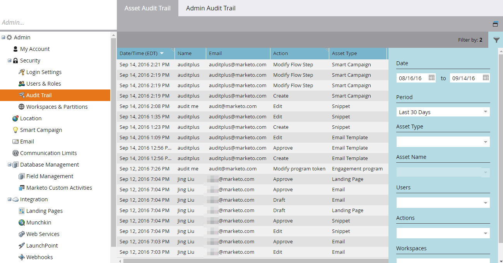

# Panoramica su Audit trail {#audit-trail-overview}

Audit Trail consente di ottenere una cronologia completa (sei mesi) delle modifiche apportate all’interno dell’istanza Marketo.

>[!NOTE]
>
>La cronologia dei dati di Audit Trail è iniziata il 14 settembre 2016.

## Cos’è Audit Trail {#what-is-audit-trail}

Audit Trail acquisisce in tempo reale un elenco completo delle azioni e degli eventi che si verificano all’interno di un abbonamento Marketo. Include una modalità autonoma di accedere alla cronologia dei dati di sei mesi per poter rispondere a domande quali:

&quot;Cos’è successo a questa risorsa o impostazione e chi l’ha aggiornata per ultimo?&quot;

&quot;Che cosa ha fatto l’utente X?&quot;

&quot;Chi accede al nostro account?&quot;

## Cosa Controlliamo {#what-we-audit}

Marketo controlla le azioni [crea, modifica ed elimina](/help/marketo/product-docs/administration/audit-trail/change-details-in-audit-trail.md) per:

* Risorse di Design Studio
* Tutti i programmi Marketo
* Campagne avanzate
* Elenchi (smart/static)
* Utenti (amministratore)
* Ruoli e autorizzazioni (amministratore)
* Workspace e partizioni (amministratore)
* Cronologia degli accessi utente

>[!NOTE]
>
>Marketo _non_ è in corso il controllo delle modifiche apportate in Web Personalization, Predictive Content o Sales Insight.

## Componenti Audit Trail {#audit-trail-components}

Audit Trail è costituito da tre componenti.

**1) [Asset Audit Trail](/help/marketo/product-docs/administration/audit-trail/change-details-in-audit-trail.md#asset-audit-trail)**

Consulta Attività eseguita su risorse specifiche.

**2) [Admin Audit Trail](/help/marketo/product-docs/administration/audit-trail/change-details-in-audit-trail.md#admin-audit-trail)**

Monitorare i dettagli basati sugli utenti.

**3) [Cronologia accesso utente](/help/marketo/product-docs/administration/audit-trail/user-login-history.md)**

Scopri chi ha effettuato l’accesso alla sottoscrizione e quando (include anche i tentativi di accesso non riusciti).

>[!TIP]
>
>Dato che è possibile controllare molte cose con Audit Trail, [filtrare](/help/marketo/product-docs/administration/audit-trail/filtering-in-audit-trail.md) può essere un grande risparmio di tempo.

## Esportazione dei dati {#exporting-data}

Puoi visualizzare solo dati relativi a 30 giorni nella tua istanza. Per ottenere un valore massimo di sei mesi, utilizza l’opzione di esportazione.

>[!NOTE]
>
>**Definizione**
>
>**Sconosciuto:** In [!DNL Webhook], il nome e l&#39;indirizzo di posta elettronica di un utente potrebbero essere elencati come &quot;Sconosciuto&quot;. Ciò si verifica quando si apporta una modifica ai valori dell’elenco di selezione nel CRM. Questi valori vengono visualizzati nei moduli e nelle pagine di destinazione di Marketo. Effettuando questo aggiornamento sul lato CRM, le pagine di destinazione che fanno riferimento al modulo verranno automaticamente redatte. In [!DNL Webhook], Marketo rileva che la pagina di destinazione è stata creata, ma il nome e l&#39;indirizzo di posta elettronica dell&#39;utente saranno &quot;Sconosciuto&quot;, in quanto Marketo non è in grado di acquisire le informazioni utente dal lato CRM.

>[!MORELIKETHIS]
>
>[Abilita prova di verifica](/help/marketo/product-docs/administration/audit-trail/enable-audit-trail.md)
