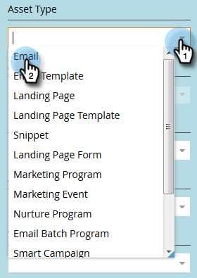

# Filtro nella traccia di audit {#filtering-in-audit-trail}

Filtrare per intervallo di tempo, tipo di risorsa, utenti, azioni eseguite e altro ancora.

1. Fai clic su **Amministratore**.

   

1. In **Sicurezza**, seleziona **Audit Trail**.

   

1. Fai clic sull’icona del filtro.

   

   >[!NOTE]
   >
   >Ci sono una moltitudine di possibili combinazioni di parametri di ricerca. In questo esempio individuiamo: _tutte le e-mail - modificate da chiunque - nei sette giorni precedenti_.

1. Fai clic sul menu a discesa **Periodo** e seleziona **Ultimi 7 giorni**.

   

1. Fai clic sul menu a discesa **Tipo di risorsa** e seleziona **E-mail**.

   

1. Fai clic sull&#39;elenco a discesa **Azioni** e seleziona **Modifica**.

   

1. Fare clic su **Applica**.

   

1. I risultati filtrati vengono visualizzati a sinistra.

   

   Tutto qui!

   >[!NOTE]
   >
   >Se le aree di lavoro sono abilitate, vengono visualizzati i dati di controllo per tutte le aree di lavoro. Se si applica un filtro area di lavoro, Marketo ricorda il valore dell&#39;area di lavoro precedente ogni volta che si utilizza audit trail. Le autorizzazioni di Workspace a livello di risorsa vengono applicate.

   >[!MORELIKETHIS]
   >
   >[Modifica dettagli in Audit Trail](/help/marketo/product-docs/administration/audit-trail/change-details-in-audit-trail.md)
