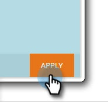

# Cronologia di accesso utente {#user-login-history}

La cronologia degli accessi utente consente di mantenere la responsabilità e la sicurezza mostrando esattamente chi ha effettuato l’accesso all’abbonamento, inclusi i tentativi di accesso non riusciti.

>[!PREREQUISITES]
>
>Per visualizzare la cronologia degli accessi utente, è necessario disporre di un ruolo con l&#39;autorizzazione Cronologia accessi abilitata.

La cronologia degli accessi utente identifica gli utenti che accedono tramite:

* Data e ora di accesso
* Nome e indirizzo e-mail dell’utente
* Ruolo
* Area di lavoro
* Indirizzo IP

Per visualizzare la cronologia degli accessi utente:

1. Passa alla schermata **[!UICONTROL Admin]**.

   

1. In Protezione fare clic su **[!UICONTROL Users & Roles]**.

   

1. Fai clic sulla scheda **[!UICONTROL Login History]**. L’elenco mostra gli accessi più recenti.

   

1. Usa il Filtro per restringere la ricerca.

   

1. Seleziona un intervallo di date utilizzando i selettori di date.

   

1. Oppure scegli dall’elenco a discesa.

   

1. Selezionare gli utenti dal menu a discesa **[!UICONTROL Users]**.

   

1. Selezionare la casella **[!UICONTROL Only Failed Logins]** per visualizzare solo gli accessi non riusciti nella ricerca.

   

1. Fai clic su **[!UICONTROL Apply]**.

   

   >[!NOTE]
   >
   >L’interfaccia utente visualizza fino a 30 giorni di dati. Per saperne di più, puoi scaricare gli ultimi sei mesi di dati in un file CSV.

   >[!MORELIKETHIS]
   >
   >[Panoramica prova di verifica](/help/marketo/product-docs/administration/audit-trail/audit-trail-overview.md)
